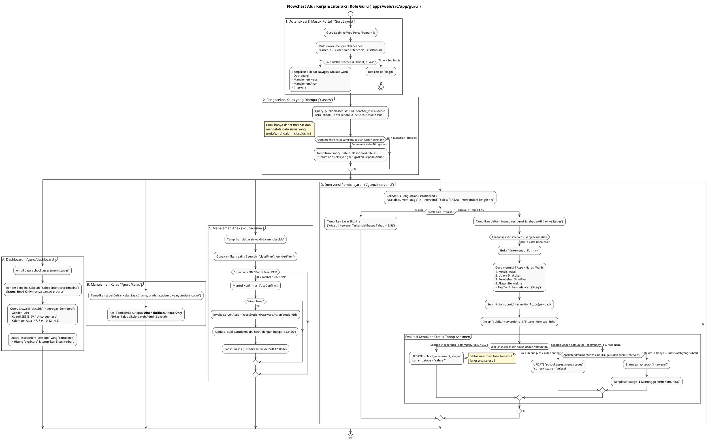

# DOKUMENTASI ANALISIS TEKNIS LENGKAP ROLE GURU (`apps/web/src/app/guru`)

**Sistem Asesmen Literasi & Numerasi Pemantik (PSPK)**  
*Dokumen ini disusun murni berdasarkan analisis implementasi kode aktual tanpa asumsi AI, membedah seluruh struktur, batasan hak akses (RLS & Authorization), alur data, server actions, serta antarmuka pada role Guru di Web Portal.*

---

## 1. PENDAHULUAN & ARSITEKTUR ROLE GURU

Role **Guru** (`role = 'teacher'`) merupakan pengguna di tingkat sekolah yang memiliki hak akses spesifik terhadap **kelas yang ditugaskan kepada mereka oleh Admin Sekolah**. 

### A. Autentikasi & Injeksi Header Proxy
Saat Guru login ke Web Portal (`apps/web`), middleware dan proxy server menginjeksi header autentikasi yang kemudian digunakan di setiap Server Component dan Server Action:
* `x-user-id`: ID akun Guru (`auth.users.id` / `public.users.id`)
* `x-user-role`: `"teacher"`
* `x-school-id`: ID Sekolah tempat guru mengajar (`public.users.school_id`)

### B. Batasan Wewenang (Guru vs Admin Sekolah)
Sistem Pemantik menerapkan prinsip *Least Privilege*:
* **Admin Sekolah (`role = 'school'`)**: Memiliki wewenang penuh mengelola seluruh kelas, mengimpor/menambah siswa, membuat akun guru, menugaskan guru ke kelas, dan mengajukan fase asesmen.
* **Guru (`role = 'teacher'`)**: Hanya berwenang melihat data **kelas yang mereka ampu (`teacher_id = x-user-id`)** beserta **siswa yang berada di dalam kelas-kelas tersebut**, mereset PIN login siswa yang lupa PIN, dan mencatat laporan intervensi pembelajaran.

---

## 2. STRUKTUR NAVIGASI & TATA LETAK (`GuruLayout` di `layout.tsx`)

File: [`apps/web/src/app/guru/layout.tsx`](file:///Users/imadearisdanuarta/Documents/KERJAAN/Develop%20pemantik/pemantik/apps/web/src/app/guru/layout.tsx)

Seluruh halaman di bawah rute `/guru/*` dibungkus oleh komponen `<AppLayout role="teacher" roleName="Guru" ...>` dengan struktur navigasi sidebar (`guruNav`) yang terbagi menjadi 3 bagian:

1. **Dashboard**: 
   * Menu: `Dashboard` (`/guru/dashboard`)
2. **Manajemen Data**:
   * Menu: `Manajemen Kelas` (`/guru/kelas`)
   * Menu: `Manajemen Anak` (`/guru/siswa`)
3. **Penilaian**:
   * Menu: `Intervensi` (`/guru/intervensi`)

---

## 3. ANALISIS RINCI HALAMAN DASHBOARD (`/guru/dashboard`)

File: [`apps/web/src/app/guru/dashboard/page.tsx`](file:///Users/imadearisdanuarta/Documents/KERJAAN/Develop%20pemantik/pemantik/apps/web/src/app/guru/dashboard/page.tsx) & [`GuruDashboardClient.tsx`](file:///Users/imadearisdanuarta/Documents/KERJAAN/Develop%20pemantik/pemantik/apps/web/src/app/guru/dashboard/GuruDashboardClient.tsx)

Halaman Dashboard menyajikan ringkasan statistik, demografi siswa yang diampu, serta status asesmen sekolah saat ini.

### A. Alur Pengambilan Data (Server Component SQL Queries)
1. **Kueri Kelas yang Diampu**:
   ```typescript
   const { data: classes } = await supabase
     .from("classes")
     .select("id")
     .eq("school_id", schoolId)
     .eq("teacher_id", teacherId)
     .eq("is_active", true);
   ```
   *Mengumpulkan array `classIds` untuk memfilter data siswa selanjutnya.*
2. **Kueri Status Asesmen Sekolah (`getStagesForSchool`)**:
   Mengambil data `school_assessment_stages` untuk ditampilkan pada **Timeline Asesmen Interaktif** (`<SchoolInteractiveTimeline isReadOnly={true} />`). Guru dapat melihat di tahap mana sekolah berada (`persiapan_akun` ➔ `pengajuan_fase` ➔ `proses_asesmen` ➔ `intervensi` ➔ `selesai`), namun timeline bersifat **Read-Only** (tombol aksi perpindahan tahap dinonaktifkan).
3. **Kueri & Agregasi Demografi Siswa**:
   Mengambil seluruh siswa di dalam `classIds` (`in("class_id", classIds)`), kemudian mengagregasi 3 dimensi demografi:
   * **Gender**: Laki-laki (`L`) vs Perempuan (`P`).
   * **Status Sosial Ekonomi (SES)**: Mengelompokkan `ses_class` menjadi kuartil (`bawah` ➔ `I`, `menengah_bawah` ➔ `II`, `menengah_atas` ➔ `III`, `atas` ➔ `IV`, atau `Uncategorized`).
   * **Kelompok Usia**: Menghitung usia dari `birth_date` (`currentYear - birthYear`) dan mengelompokkan ke dalam `< 7 tahun`, `7-9 tahun`, `10-12 tahun`, `> 12 tahun`, atau `unknown`.
4. **Statistik Asesmen & Sesi Selesai (`completedSessions` & `avgScore`)**:
   Mengambil sesi asesmen dari tabel `assessment_sessions` milik siswa yang diampu di mana `status = 'completed'` dan `is_void = false`. Menghitung rata-rata skor (`avgScore`) dan mengambil 5 sesi pengerjaan terbaru (`recentSessions`).

### B. Komponen Klien (`GuruDashboardClient.tsx`)
Menampilkan kartu statistik ringkas, bagan demografi, serta daftar riwayat sesi pengerjaan siswa terbaru yang dilengkapi nama anak, kelas, nama paket soal, dan skor akhir.

---

## 4. ANALISIS RINCI MANAJEMEN KELAS (`/guru/kelas`)

File: [`apps/web/src/app/guru/kelas/page.tsx`](file:///Users/imadearisdanuarta/Documents/KERJAAN/Develop%20pemantik/pemantik/apps/web/src/app/guru/kelas/page.tsx) & [`KelasManagerGuru.tsx`](file:///Users/imadearisdanuarta/Documents/KERJAAN/Develop%20pemantik/pemantik/apps/web/src/app/guru/kelas/KelasManagerGuru.tsx)

Halaman ini berfokus menampilkan daftar rombongan belajar (kelas) yang diampu oleh Guru tersebut.

### A. Kueri Data Kelas & Jumlah Anak
Server Component melakukan query pada tabel `classes` yang distempel ID Guru dan mengelompokkan jumlah siswa aktif per kelas:
```typescript
const { data: rawClasses } = await supabase
  .from("classes")
  .select("id, name, grade, academic_year, students(count)")
  .eq("school_id", schoolId)
  .eq("teacher_id", teacherId)
  .eq("is_active", true)
  .order("grade").order("name");
```

### B. Karakteristik Read-Only
Berbeda dengan halaman Manajemen Kelas pada Admin Sekolah (`/sekolah/kelas`) yang memiliki tombol *Tambah Kelas*, *Edit*, dan *Hapus*, antarmuka Guru (`KelasManagerGuru.tsx`) bersifat **Read-Only**:
> *"Ini adalah daftar kelas yang ditugaskan kepada Anda oleh Admin Sekolah. Anda hanya bisa mengelola siswa di dalam kelas-kelas ini."*

Guru tidak dapat membuat kelas baru atau mengubah penugasan dirinya sendiri. Alokasi kelas sepenuhnya menjadi tanggung jawab Admin Sekolah atau Admin Komunitas.

---

## 5. ANALISIS RINCI MANAJEMEN ANAK (`/guru/siswa`)

File: [`apps/web/src/app/guru/siswa/page.tsx`](file:///Users/imadearisdanuarta/Documents/KERJAAN/Develop%20pemantik/pemantik/apps/web/src/app/guru/siswa/page.tsx) & [`StudentsManagerGuru.tsx`](file:///Users/imadearisdanuarta/Documents/KERJAAN/Develop%20pemantik/pemantik/apps/web/src/app/guru/siswa/StudentsManagerGuru.tsx)

Halaman ini memungkinkan Guru melihat daftar siswa di kelasnya dan membantu menangani masalah kredensial login (PIN).

### A. Pengambilan Data Siswa
Sistem mengambil seluruh siswa dari tabel `students` beserta relasi ke kelas (`classes!students_class_id_fkey`) yang memenuhi syarat `in("class_id", classIds)` dan `eq("school_id", schoolId)`.

### B. Filter & Pencarian Siswa (`StudentsManagerGuru.tsx`)
Komponen klien menyediakan alat bantu pencarian dan penyaringan data secara reaktif (`useMemo`):
* **Pencarian Teks**: Mencocokkan nama lengkap (`full_name`), `NISN`, atau `username`.
* **Filter Kelas (`classFilter`)**: Menyaring siswa berdasarkan kelas spesifik yang diampu guru.
* **Filter Gender (`genderFilter`)**: Menyaring siswa laki-laki (`L`) atau perempuan (`P`).

### C. Fitur Kunci: Reset PIN Siswa (`resetStudentPasswordAction`)
Karena siswa anak-anak sering kali lupa PIN login mobile mereka, sistem memberi kewenangan kepada Guru untuk mereset PIN tersebut:
1. Guru menekan tombol **Reset PIN** pada baris siswa yang bersangkutan.
2. Muncul dialog konfirmasi (`useConfirm`).
3. Jika disetujui, aplikasi memanggil Server Action `resetStudentPasswordAction(studentId)` di `apps/web/src/app/actions/students.ts`:
   ```typescript
   export async function resetStudentPasswordAction(studentId: string) {
     const defaultPin = "123456";
     const hashed = bcrypt.hashSync(defaultPin, 10);
     await supabase.from("students").update({ pin_hash: hashed }).eq("id", studentId);
   }
   ```
4. PIN siswa berhasil dikembalikan ke PIN default (`123456`) sehingga siswa dapat langsung login kembali di aplikasi mobile.

### D. Mengapa Guru Tidak Bisa Tambah / Hapus Siswa?
Pada rancangan sistem Pemantik, penambahan siswa (baik manual maupun via sinkronisasi/import Dapodik) serta penghapusan siswa dikunci di level Admin Sekolah (`/sekolah/siswa`). Hal ini menjaga integritas data pokok pendidikan (Dapodik) agar tidak terjadi mutasi atau duplikasi data siswa tanpa persetujuan pihak administrasi sekolah.

---

## 6. ANALISIS RINCI RIWAYAT PEMBINAAN & INTERVENSI (`/guru/intervensi`)

File: [`apps/web/src/app/guru/intervensi/page.tsx`](file:///Users/imadearisdanuarta/Documents/KERJAAN/Develop%20pemantik/pemantik/apps/web/src/app/guru/intervensi/page.tsx) & [`IntervensiGuruClient.tsx`](file:///Users/imadearisdanuarta/Documents/KERJAAN/Develop%20pemantik/pemantik/apps/web/src/app/guru/intervensi/IntervensiGuruClient.tsx)

Menu Intervensi adalah pusat aktivitas pedagogis Guru untuk mencatat langkah-langkah pembinaan nyata setelah siswa menyelesaikan pengerjaan asesmen mobile.

### A. Mekanisme Penguncian Akses (`isUnlocked`)
Halaman ini menerapkan gerbang logika ketat sebelum menampilkan data:
```typescript
const isUnlocked = stages.some((s: any) => ["intervensi", "selesai"].includes(s.current_stage)) || interventions.length > 0;
```
* **Jika Terkunci (`isUnlocked === false`)**: Sistem merender layar blokir dengan ikon 🔒 dan pesan:
  > *"Akses Intervensi Terkunci (Khusus Tahap 4 & 5). Menu Intervensi baru dapat diakses setelah sekolah Anda menyelesaikan atau melewati Tahap 3 (Proses Asesmen)."*
* **Jika Terbuka (`isUnlocked === true`)**: Sistem menampilkan daftar laporan pembinaan yang pernah dibuat, serta daftar tahap asesmen yang saat ini sedang aktif di fase intervensi (`activeStages`).

### B. Pencatatan Laporan Pembinaan (`InterventionForm` & `submitInterventionAction`)
Ketika sekolah memasuki Tahap 4 (`intervensi`), Guru dapat menekan tombol **`+ Catat Intervensi`** pada fase yang bersangkutan, yang akan membuka `<InterventionForm />` dengan 4 aspek narasi wajib:
1. **Kondisi Awal (`kondisi_awal`)**: Diagnosa atau temuan dari hasil asesmen siswa di kelas.
2. **Upaya Dilakukan (`upaya_dilakukan`)**: Langkah konkrit atau metode pengajaran/intervensi yang diterapkan guru.
3. **Perubahan Signifikan (`perubahan_signifikan`)**: Hasil atau perkembangan yang ditunjukkan oleh siswa setelah intervensi.
4. **Alasan Bermakna (`alasan_bermakna`)**: Refleksi guru mengapa metode tersebut efektif atau perlu penyesuaian.
5. **Tag Topik (`intervention_tags`)**: Kata kunci/label topik pemahaman (misalnya `#AljabarDasar`, `#MembacaPemahaman`) yang dikaitkan ke tabel `intervention_tag_links`.

### C. Logika Kenaikan Status ke Selesai (`submitInterventionAction` di `interventions.ts`)
Saat Guru mengirimkan laporan intervensi melalui `submitInterventionAction()`, sistem melakukan evaluasi otomatis pada lines 218-245 apakah tahap asesmen sekolah (`school_assessment_stages`) dapat langsung dipindahkan ke `current_stage = 'selesai'`:

```typescript
const isIndependentSchool = !stage.community_id;
const shouldCompleteStage = isIndependentSchool 
  ? hasSchoolSubmission 
  : (hasCommunitySubmission && hasSchoolSubmission);

if (shouldCompleteStage) {
  await supabase.from("school_assessment_stages")
    .update({ current_stage: "selesai", stage_updated_at: new Date().toISOString() })
    .eq("id", payload.stageId);
}
```
* **Sekolah Independen (`community_id IS NULL`)**: Begitu Guru (atau Admin Sekolah) mensubmit laporan intervensi pertama mereka, tahap asesmen langsung berubah menjadi **`selesai`**.
* **Sekolah Binaan Komunitas (`community_id IS NOT NULL`)**: Diperlukan **2 laporan intervensi terpisah**, yaitu 1 dari pihak Sekolah/Guru (`hasSchoolSubmission`) dan 1 dari pihak Admin Komunitas Induk (`hasCommunitySubmission`). Jika baru Guru yang mensubmit, tahap tetap `intervensi` dan UI menampilkan badge `⏳ Menunggu Form Komunitas`. Setelah Komunitas ikut mensubmit, tahap otomatis berubah menjadi **`selesai`**.

---

## 7. RINGKASAN INTEGRASI FILE KODE ROLE GURU

| Rute / Komponen | Path File di `apps/web` | Fungsi Utama |
| :--- | :--- | :--- |
| **Layout & Navigasi** | `src/app/guru/layout.tsx` | Membungkus sidebar khusus Guru (`Dashboard`, `Manajemen Kelas`, `Manajemen Anak`, `Intervensi`) & proteksi role (`role = 'teacher'`). |
| **Dashboard Page** | `src/app/guru/dashboard/page.tsx`<br>`src/app/guru/dashboard/GuruDashboardClient.tsx` | Mengambil kelas yang diampu, menghitung statistik & demografi siswa (`gender`, `ses`, `age`), menampilkan grafik & 5 sesi pengerjaan terbaru, serta timeline sekolah (Read-Only). |
| **Manajemen Kelas** | `src/app/guru/kelas/page.tsx`<br>`src/app/guru/kelas/KelasManagerGuru.tsx` | Menampilkan daftar kelas yang ditugaskan beserta jumlah anak (Read-Only tanpa opsi tambah/hapus kelas). |
| **Manajemen Anak** | `src/app/guru/siswa/page.tsx`<br>`src/app/guru/siswa/StudentsManagerGuru.tsx` | Menampilkan daftar siswa di kelas yang diampu, filter pencarian reaktif, dan fitur **Reset PIN Anak ke default `123456`**. |
| **Riwayat Intervensi** | `src/app/guru/intervensi/page.tsx`<br>`src/app/guru/intervensi/IntervensiGuruClient.tsx` | Mengecek penguncian akses (`isUnlocked`), menampilkan daftar laporan intervensi yang pernah dibuat, serta membuka form pencatatan intervensi pada tahap aktif. |
| **Server Actions** | `src/app/actions/students.ts`<br>`src/app/actions/interventions.ts` | Menyediakan `resetStudentPasswordAction` (reset PIN siswa) dan `submitInterventionAction` (simpan laporan 4 aspek narasi + auto-transition stage ke `selesai`). |

---

## 8. KODE PLANTUML ALUR KERJA & INTERAKSI ROLE GURU

Berikut adalah kode PlantUML Activity & Sequence Diagram yang menggambarkan alur kerja lengkap dan otorisasi role Guru di Web Portal:


