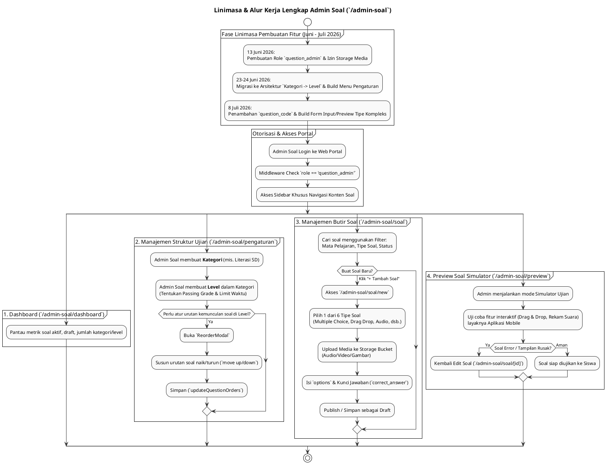

# DOKUMENTASI ANALISIS FITUR & LINIMASA ROLE ADMIN SOAL (`admin-soal`)

**Sistem Asesmen Literasi & Numerasi Pemantik (PSPK)**  
*Dokumen ini disusun murni berdasarkan analisis implementasi kode aktual (`apps/web/src/app/admin-soal`) dan riwayat penanggalan migrasi database tanpa asumsi AI, membedah kapabilitas role `question_admin` serta kronologi pembangunannya.*

---

## 1. PENDAHULUAN & RENTANG WAKTU PENGEMBANGAN

Role **Admin Soal** (`role = 'question_admin'`) adalah pengguna yang didedikasikan khusus sebagai kreator dan pengelola bank soal (Content Management). Mereka memiliki hak penuh atas tabel `questions`, `question_categories`, dan `question_levels` beserta media penyertanya di *Storage Bucket*, tanpa memiliki akses ke data operasional sekolah atau pengguna lain.

### 📅 Rentang Waktu Pengembangan Aktual (Timeline Range):
**`13 Juni 2026` – `Juli 2026`**

> [!NOTE]
> **Klarifikasi Penanggalan Berkas Migrasi Awal**:  
> Sama halnya dengan modul sistem lain, seluruh pengembangan fitur Admin Soal ini dikerjakan secara intensif pada **Juni – Juli 2026**. Penamaan file migrasi awal `20250613...` merupakan bug/typo penanggalan, sedangkan tanggal eksekusi nyatanya adalah **13 Juni 2026**.

---

## 2. LINIMASA (TIMELINE) LENGKAP EVOLUSI FITUR ADMIN SOAL (2026)

Berikut adalah linimasa kronologis spesifik untuk pengembangan fitur-fitur dan fondasi data yang memberdayakan modul Admin Soal:

```
[13 JUN 2026] ──► FONDASI ROLE & HAK AKSES MEDIA AWAL
                  • Pembuatan enum role `question_admin` pada tabel `public.users` (`initial_schema.sql`).
                  • Deklarasi RLS Policies (Keamanan Akses Data) yang memisahkan hak akses `question_admin` secara eksplisit (`rls_policies.sql`).
                  • Deklarasi *Storage Bucket Policies* (`ADD_STORAGE_BUCKET.sql`) yang mengizinkan Admin Soal mengunggah file media (Audio/Video/Gambar) untuk kebutuhan soal.

[23-24 JUN 2026] ─► HIERARKI KATEGORI, LEVEL, & AUTO PILOT
                  • Migrasi besar-besaran dari struktur "paket soal" tunggal menjadi arsitektur hierarkis: `question_categories` ➔ `question_levels` ➔ `questions` (`migrate_to_categories.sql` & `auto_pilot_packages.sql`).
                  • Pembentukan antarmuka **Pengaturan Kategori & Level** (`/admin-soal/pengaturan`) untuk mengelola arsitektur baru ini.

[8 JUL 2026] ────► PENGKODEAN SOAL & PENGAYAAN STRUKTUR
                  • Penambahan field `question_code` pada butir soal untuk kemudahan katalogisasi (`20260708000001_add_question_code_and_level_responses.sql`).
                  • Pemantapan antarmuka **Input Soal Baru** (`/admin-soal/soal/new`) dan **Preview Soal** (`/admin-soal/preview`) yang mampu memproses beragam tipe soal kompleks (Drag & Drop, Image Choice, Voice Recording).
```

---

## 3. ANALISIS RINCI 5 FITUR / MENU UTAMA ADMIN SOAL

Seluruh struktur fitur Admin Soal terpusat pada direktori [`apps/web/src/app/admin-soal`](file:///Users/imadearisdanuarta/Documents/KERJAAN/Develop%20pemantik/pemantik/apps/web/src/app/admin-soal) yang dibagi ke dalam 3 kelompok menu utama pada [`layout.tsx`](file:///Users/imadearisdanuarta/Documents/KERJAAN/Develop%20pemantik/pemantik/apps/web/src/app/admin-soal/layout.tsx):

### A. KELOMPOK 1: DASHBOARD
1. **Dashboard (`/admin-soal/dashboard`)**:
   * **Fungsi**: Pusat informasi metrik mengenai konten bank soal yang dikelola.
   * **Fitur Utama**: Menyajikan statistik jumlah soal yang dibuat, aktif (published), draft, serta jumlah kategori dan level yang tersedia.

---

### B. KELOMPOK 2: KONTEN SOAL
2. **Daftar Soal (`/admin-soal/soal`)**:
   * **Fungsi**: Tabel repositori seluruh butir soal yang ada di platform.
   * **Fitur Utama**: Memiliki filter pencarian *(Server-Side Filtering)* yang sangat rinci:
     * Pencarian berbasis teks.
     * Filter Mata Pelajaran (`literasi`, `numerasi`).
     * Filter Tipe Soal (`multiple_choice`, `drag_drop`, `image_choice`, `audio_question`, `video_question`, `voice_recording`).
     * Filter Status (`published`, `draft`).

3. **Input & Edit Soal (`/admin-soal/soal/new` & `/admin-soal/soal/[id]`)**:
   * **Fungsi**: Form interaktif lengkap (CRUD) untuk membuat rancangan soal (*Question Builder*).
   * **Fitur Utama**: Form dinamis yang menyesuaikan input struktur jawaban (*correct_answer*) dan opsi (*options*) berdasarkan 6 tipe soal yang didukung:
     1. Pilihan Ganda (*Multiple Choice*)
     2. Pilihan Gambar (*Image Choice*)
     3. Audio (*Audio Question*)
     4. Video (*Video Question*)
     5. Seret dan Lepas (*Drag & Drop*) - mencakup *matching*, *sorting*, dan *fill in the blank*.
     6. Rekaman Suara (*Voice Recording*) dengan validasi akurasi ambang batas (*threshold_pct*).

4. **Preview Soal (`/admin-soal/preview`)**:
   * **Fungsi**: Simulator pengalaman pengerjaan soal.
   * **Fitur Utama**: Admin Soal dapat mencoba mengerjakan dan memvalidasi tampilan interaktif dari butir-butir soal yang baru mereka buat, persis seperti tampilan yang akan dihadapi siswa pada aplikasi Mobile. Menekan risiko kesalahan teknis/display saat soal dirilis.

---

### C. KELOMPOK 3: SISTEM
5. **Pengaturan Kategori & Level (`/admin-soal/pengaturan`)**:
   * **Fungsi**: Pengelolaan kurikulum atau arsitektur evaluasi secara keseluruhan (`PengaturanClient.tsx`).
   * **Fitur Utama**:
     * Pembuatan atau penyuntingan **Kategori** (misal: "Literasi SD Kelas 1").
     * Pembuatan **Level** di dalam tiap Kategori (menentukan passing grade, durasi, jumlah soal yang harus dikerjakan).
     * **Modal Pengurutan Soal (ReorderModal)**: Antarmuka yang memungkinkan admin mengatur urutan naik/turun (*move up/down*) butir-butir soal di dalam sebuah Level secara spesifik (`updateQuestionOrders`).

---

## 4. KODE PLANTUML ALUR KERJA & LINIMASA ADMIN SOAL

Berikut adalah kode PlantUML komprehensif yang memetakan evolusi linimasa serta alur logika kerja role Admin Soal (*Question Admin*):


