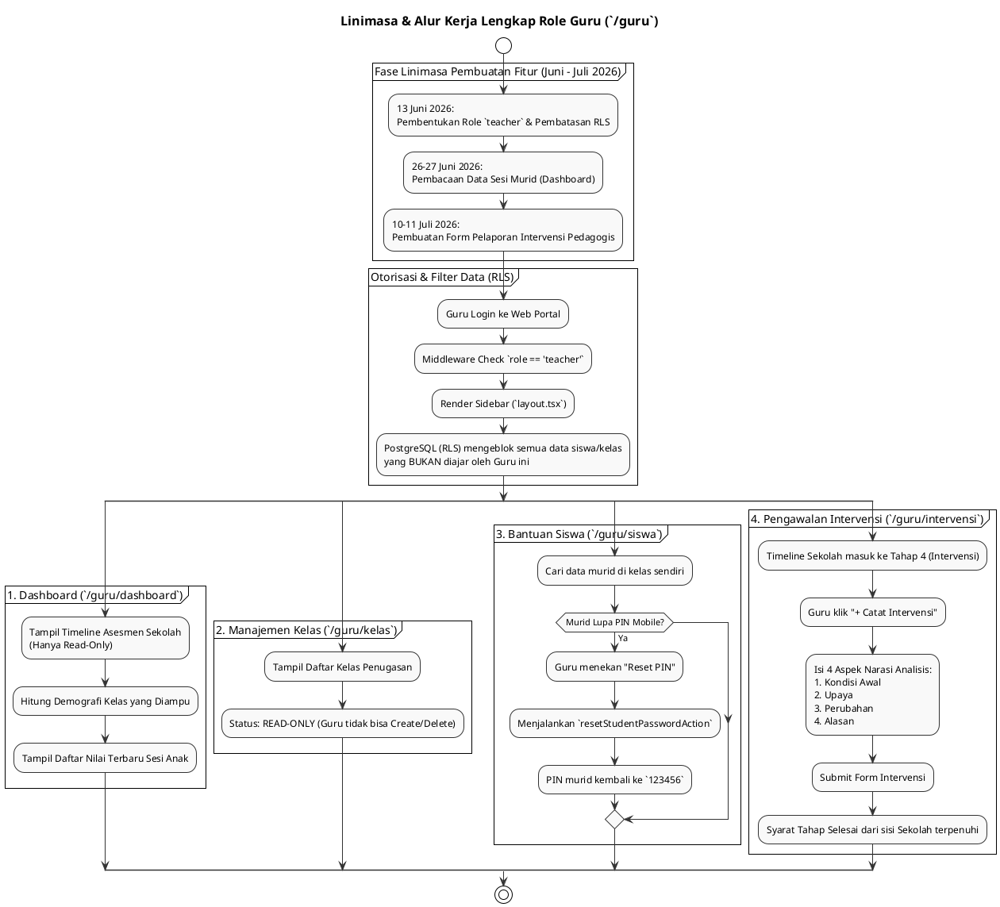

# DOKUMENTASI ANALISIS FITUR & LINIMASA ROLE GURU (`guru`)

**Sistem Asesmen Literasi & Numerasi Pemantik (PSPK)**  
*Dokumen ini disusun murni berdasarkan analisis implementasi kode aktual (`apps/web/src/app/guru`) dan riwayat penanggalan migrasi database tanpa asumsi AI, membedah kapabilitas role `teacher` serta kronologi pembangunannya.*

---

## 1. PENDAHULUAN & RENTANG WAKTU PENGEMBANGAN

Role **Guru** (`role = 'teacher'`) merupakan pengguna ujung tombak di tingkat satuan pendidikan. Dalam sistem Pemantik, arsitektur wewenang Guru dibangun menggunakan prinsip **Least Privilege (Hak Akses Minimum)**. Guru **tidak dapat** memanipulasi data struktur sekolah (tidak bisa menambah kelas, tidak bisa menghapus siswa, tidak bisa mengelola asesmen). 

Wewenang Guru dibatasi secara ketat oleh Row Level Security (RLS) di database: *Seorang Guru hanya dapat melihat dan berinteraksi dengan Siswa yang berada di dalam Kelas yang secara spesifik telah ditugaskan kepadanya oleh Admin Sekolah.*

### 📅 Rentang Waktu Pengembangan Aktual (Timeline Range):
**`13 Juni 2026` – `11 Juli 2026`**

> [!NOTE]
> **Klarifikasi Penanggalan Berkas Migrasi Awal**:  
> Sama halnya dengan modul sistem lain, seluruh pengembangan fitur Guru ini dikerjakan secara intensif pada **Juni – Juli 2026**. Penamaan file migrasi awal `20250613...` merupakan bug/typo penanggalan, sedangkan tanggal eksekusi nyatanya adalah **13 Juni 2026**.

---

## 2. LINIMASA (TIMELINE) LENGKAP EVOLUSI FITUR GURU (2026)

Berikut adalah linimasa kronologis spesifik untuk pengembangan fitur-fitur yang berpusat pada hak akses Guru:

```
[13 JUN 2026] ──► FONDASI ROLE GURU & PROTEKSI RLS
                  • Pembuatan enum role `teacher` pada tabel `public.users` (`initial_schema.sql`).
                  • Deklarasi RLS Policies (`rls_policies.sql`) yang menjadi fondasi keamanan: Guru HANYA diizinkan membaca (`SELECT`) row dari tabel `students` dan `assessment_sessions` yang berelasi dengan `classes` di mana `classes.teacher_id` sama dengan ID Guru tersebut.

[26-27 JUN 2026] ─► PEMBACAAN SESI ASESMEN
                  • Pembuatan arsitektur laporan (`week4_report_view.sql`).
                  • Guru diberikan antarmuka Dashboard untuk memantau nilai (skor akhir) secara *real-time* dari murid-murid di kelas yang diampunya sesaat setelah murid menyelesaikan ujian di aplikasi mobile.

[10-11 JUL 2026] ─► TUGAS UTAMA: INTERVENSI PEMBELAJARAN
                  • Pembuatan tabel pelaporan intervensi & AI Knowledge Graph (`superadmin_ai_knowledge_graph.sql`).
                  • Pembentukan menu **Intervensi** (`/guru/intervensi`). Ini adalah fitur interaktif paling utama milik Guru. Di Tahap 4 (Intervensi), sistem akan "mengunci" sekolah sampai Guru men-submit form evaluasi pedagogis atas kelasnya.
```

---

## 3. ANALISIS RINCI 4 FITUR / MENU UTAMA GURU

Seluruh struktur fitur Guru terpusat pada direktori [`apps/web/src/app/guru`](file:///Users/imadearisdanuarta/Documents/KERJAAN/Develop%20pemantik/pemantik/apps/web/src/app/guru) yang dikendalikan oleh layout utama [`layout.tsx`](file:///Users/imadearisdanuarta/Documents/KERJAAN/Develop%20pemantik/pemantik/apps/web/src/app/guru/layout.tsx):

### A. KELOMPOK 1: DASHBOARD
1. **Dashboard (`/guru/dashboard`)**:
   * **Fungsi**: Pusat pendaratan dan analitik kelas yang diampu.
   * **Fitur Utama**: 
     * **Timeline Asesmen (Read-Only)**: Guru dapat melihat di tahap mana sekolahnya berada (misal: "Tahap 3 - Proses Asesmen"), namun guru tidak memiliki tombol untuk mengubah/memajukan tahapan tersebut.
     * **Demografi Kelas**: Menampilkan diagram distribusi status sosial ekonomi (SES), gender, dan rentang usia *khusus* untuk siswa-siswa di kelas yang diajarnya.
     * **Sesi Terbaru**: Tabel riwayat nilai skor ujian murid yang baru saja selesai mengerjakan soal di aplikasi mobile.

---

### B. KELOMPOK 2: MANAJEMEN DATA (SIFAT: BACA & BANTU)
2. **Manajemen Kelas (`/guru/kelas`)**:
   * **Fungsi**: Peninjauan rombongan belajar.
   * **Fitur Utama**: Bersifat murni **Read-Only**. Menampilkan daftar kelas yang telah ditugaskan kepadanya oleh Admin Sekolah (beserta informasi jumlah anak di dalamnya). Guru tidak memiliki tombol *Tambah*, *Edit*, atau *Hapus* kelas.

3. **Manajemen Anak / Siswa (`/guru/siswa`)**:
   * **Fungsi**: Pemantauan profil peserta didik dan resolusi masalah login anak.
   * **Fitur Utama**: Menampilkan daftar anak (NISN, Gender) di kelas yang diampu. Guru tidak dapat memanipulasi data profil anak, TETAPI guru dibekali satu *Server Action* krusial: **Tombol "Reset PIN"** (`resetStudentPasswordAction`). Jika ada anak yang lupa PIN 6-digitnya saat mencoba login di aplikasi mobile, guru dapat langsung menekan tombol ini untuk mengembalikan PIN anak ke default (`123456`).

---

### C. KELOMPOK 3: PENILAIAN
4. **Intervensi (`/guru/intervensi`)**:
   * **Fungsi**: Laporan evaluasi kualitatif pasca-ujian (Tahap 4).
   * **Fitur Utama**: Inilah satu-satunya form input kompleks yang menjadi tanggung jawab penuh Guru. Guru wajib menyusun laporan pedagogis (mengisi 4 parameter naratif dan memberikan *Tagging Topik*) untuk merefleksikan hasil belajar kelasnya. *Sistem tidak akan mengizinkan Admin Sekolah memajukan tahap ke "Selesai" sebelum Guru menyelesaikan form ini.*

---

## 4. KODE PLANTUML ALUR KERJA & LINIMASA GURU

Berikut adalah kode Diagram PlantUML yang memvisualisasikan bagaimana posisi Guru (sebagai aktor dengan wewenang terbatas) beroperasi di dalam ekosistem Pemantik:


