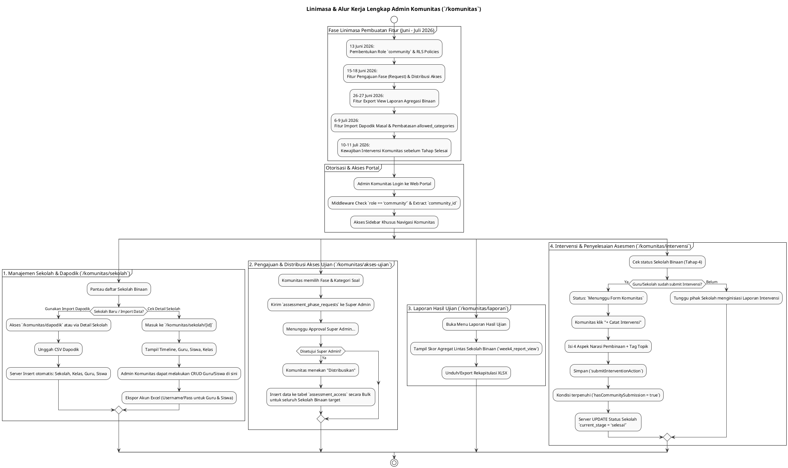

# DOKUMENTASI ANALISIS FITUR & LINIMASA ROLE KOMUNITAS (`komunitas`)

**Sistem Asesmen Literasi & Numerasi Pemantik (PSPK)**  
*Dokumen ini disusun murni berdasarkan analisis implementasi kode aktual (`apps/web/src/app/komunitas`) dan riwayat penanggalan migrasi database tanpa asumsi AI, membedah kapabilitas role `community` serta kronologi pembangunannya.*

---

## 1. PENDAHULUAN & RENTANG WAKTU PENGEMBANGAN

Role **Komunitas** (`role = 'community'`) berfungsi sebagai Dinas Pendidikan, Yayasan, atau Organisasi Induk Pembina yang menaungi banyak **Sekolah Binaan** (`public.schools` di mana `community_id` cocok dengan akun komunitas tersebut). Admin Komunitas bertugas mendistribusikan jadwal asesmen, mengimpor data Dapodik masal, memantau agregasi nilai lintas sekolah binaan, serta mengisi form intervensi sebagai pihak pembina.

### 📅 Rentang Waktu Pengembangan Aktual (Timeline Range):
**`13 Juni 2026` – `14 Juli 2026`**

> [!NOTE]
> **Klarifikasi Penanggalan Berkas Migrasi Awal**:  
> Sama halnya dengan modul sistem lain, seluruh pengembangan fitur Komunitas ini dikerjakan secara intensif pada **Juni – Juli 2026**. Penamaan file migrasi awal `20250613...` merupakan bug/typo penanggalan, sedangkan tanggal eksekusi nyatanya adalah **13 Juni 2026**.

---

## 2. LINIMASA (TIMELINE) LENGKAP EVOLUSI FITUR KOMUNITAS (2026)

Berikut adalah linimasa kronologis spesifik untuk pengembangan fitur-fitur yang berpusat pada hak akses Komunitas:

```
[13 JUN 2026] ──► FONDASI AWAL KOMUNITAS
                  • Pembuatan enum role `community` dan tabel `public.communities`.
                  • Pemasangan RLS Policies (`rls_policies.sql`) yang menjamin Admin Komunitas hanya dapat mengakses data sekolah, guru, anak, dan sesi asesmen yang `community_id`-nya sesuai dengan ID mereka.

[15-18 JUN 2026] ─► DISTRIBUSI AKSES UJIAN
                  • Pembuatan tabel `assessment_phase_requests` & `assessment_access` (`phase2_access_management.sql`).
                  • Pembentukan menu **Akses Ujian** (`/komunitas/akses-ujian`) agar Komunitas dapat mengajukan jadwal asesmen ke pusat (Super Admin) dan mendistribusikannya ke seluruh sekolah binaan.

[26-27 JUN 2026] ─► VIEW LAPORAN AGREGASI KELULUSAN
                  • Pembuatan View Laporan Lintas Sekolah (`week4_report_view.sql`).
                  • Pembentukan menu **Hasil Ujian** (`/komunitas/laporan`) yang menyajikan ekspor skor agregat per kelas dan per sekolah binaan.

[6-8 JUL 2026] ──► REVOLUSI MANAJEMEN DATA: IMPORT DAPODIK
                  • Penciptaan fitur Import Dapodik Masal berbasis transaksi DB (`dapodik_import.sql`).
                  • Pembentukan menu **Upload Dapodik** (`/komunitas/dapodik`) dan penyematan fitur Bulk Upload di menu Detail Sekolah. Komunitas tidak perlu memasukkan guru/siswa satu per satu.

[9 JUL 2026] ────► KENDALI KATEGORI & ROMBAK SKEMA SEKOLAH
                  • Restrukturisasi skema `communities` dengan penambahan fitur `allowed_categories` (`add_allowed_categories_to_communities.sql`). Komunitas kini bisa dibatasi hanya untuk mengakses paket soal tertentu (misal: Literasi saja).
                  • Pemisahan tegas entitas Sekolah Binaan dengan Sekolah Independen (`community_rombak_schema.sql`).

[10-11 JUL 2026] ─► PENGAWALAN INTERVENSI LINTAS SEKOLAH
                  • Pembuatan arsitektur pelaporan intervensi & Knowledge Graph AI (`superadmin_ai_knowledge_graph.sql`).
                  • Terciptanya menu **Intervensi** (`/komunitas/intervensi`). Komunitas berperan wajib untuk turut mengisi *Form Laporan Pembinaan* bersama Guru agar tahap asesmen sebuah sekolah bisa dianggap "Selesai".
```

---

## 3. ANALISIS RINCI 6 FITUR / MENU UTAMA KOMUNITAS

Seluruh struktur fitur Komunitas terpusat pada direktori [`apps/web/src/app/komunitas`](file:///Users/imadearisdanuarta/Documents/KERJAAN/Develop%20pemantik/pemantik/apps/web/src/app/komunitas) yang dibagi ke dalam 4 kelompok menu utama pada [`layout.tsx`](file:///Users/imadearisdanuarta/Documents/KERJAAN/Develop%20pemantik/pemantik/apps/web/src/app/komunitas/layout.tsx):

### A. KELOMPOK 1: DASHBOARD
1. **Dashboard (`/komunitas/dashboard`)**:
   * **Fungsi**: Pusat informasi eksekutif Komunitas.
   * **Fitur Utama**: Menyajikan statistik agregat: Total Sekolah Binaan, Total Guru, Total Siswa Binaan, dan Total Sesi Asesmen Selesai. Juga menampilkan daftar tahapan (*Timeline*) yang saat ini aktif di sekolah binaan mereka.

---

### B. KELOMPOK 2: MANAJEMEN
2. **Sekolah (`/komunitas/sekolah`) & Detail Binaan (`/komunitas/sekolah/[id]`)**:
   * **Fungsi**: Pusat manajemen komprehensif untuk seluruh sekolah naungan.
   * **Fitur Utama**: 
     * Saat Admin Komunitas masuk ke Detail Sekolah (`SchoolDetailKomunitas.tsx`), mereka memiliki kekuatan penuh layaknya Admin Sekolah untuk melakukan CRUD (Buat, Baca, Ubah, Hapus) pada tabel `users (Guru)`, `students (Siswa)`, dan `classes (Kelas)` khusus untuk sekolah tersebut.
     * **Upload Dapodik (Per-Sekolah)**: Fitur Bulk Upload CSV.
     * **Ekspor Akun Masal (`XLSX`)**: Fitur membuat file Excel yang berisi rincian Username dan Password Default (`Password123!`) bagi seluruh Admin Sekolah, Guru, dan Siswa pada sekolah binaan tersebut.

3. **Upload Dapodik Global (`/komunitas/dapodik`)**:
   * **Fungsi**: Portal unggah (*Bulk Upload*) data pendidikan nasional.
   * **Fitur Utama**: Menjalankan *Server Action* `importDapodikAction` yang langsung menstrukturkan dan mem-parsing data CSV menjadi Sekolah, Guru, Siswa, dan Kelas dalam hitungan detik.

4. **Akses Ujian (`/komunitas/akses-ujian`)**:
   * **Fungsi**: Distribusi dan pengajuan paket evaluasi (`AksesUjianKomunitasClient.tsx`).
   * **Fitur Utama**:
     * **Pengajuan Fase**: Komunitas memilih target fase (misal: "Fase B") beserta sekolah binaan, kemudian mengirim permintaan (*Phase Request*) persetujuan ke Super Admin.
     * **Distribusi Masal**: Setelah Super Admin memberikan Izin Akses Ujian, Admin Komunitas langsung menekan "Distribusikan" yang secara *bulk* menyisipkan token/record asesmen ke tabel `assessment_access` untuk semua sekolah binaan secara serentak.

---

### C. KELOMPOK 3: UJIAN
5. **Hasil Ujian (`/komunitas/laporan`)**:
   * **Fungsi**: Modul pelaporan analitik (*Assessment Reports*).
   * **Fitur Utama**: Menampilkan dan mengekspor nilai (Skor Akhir), durasi pengerjaan, capaian passing grade siswa di seluruh sekolah binaan secara agregat. Diambil secara *real-time* dari view PostgreSQL (`week4_report_view`).

---

### D. KELOMPOK 4: INTERVENSI
6. **Form & Laporan Intervensi (`/komunitas/intervensi`)**:
   * **Fungsi**: Pemantauan tahapan pembinaan (Tahap 4). Menu ini bersifat dinamis; labelnya berubah menjadi "Form & Laporan Intervensi" saat ada sekolah yang memasuki Tahap Intervensi (`hasReachedIntervention = true` di `layout.tsx`).
   * **Fitur Utama**:
     * **Sistem Gembok Kenaikan Tahap**: Seperti yang terlihat di `submitInterventionAction`, agar siklus asesmen sebuah sekolah binaan bisa disahkan menjadi "Selesai" (Tahap 5), maka **harus ada 2 Laporan Intervensi yang diajukan**: Satu dari pihak Guru/Sekolah, dan Satu dari pihak Admin Komunitas (`hasCommunitySubmission = true`). Tanpa keterlibatan Komunitas, sekolah akan tersendat dengan status *Menunggu Form Komunitas*.

---

## 4. KODE PLANTUML ALUR KERJA & LINIMASA KOMUNITAS

Berikut adalah kode PlantUML komprehensif yang memetakan evolusi linimasa serta alur logika kerja role Admin Komunitas:


