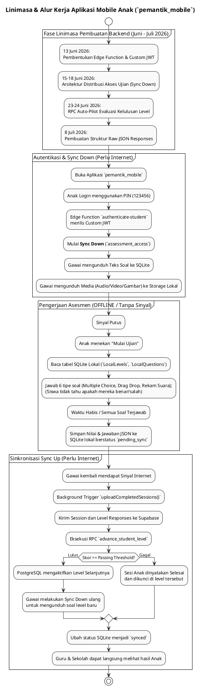

# DOKUMENTASI ANALISIS FITUR & LINIMASA ROLE ANAK (`pemantik_mobile`)

**Sistem Asesmen Literasi & Numerasi Pemantik (PSPK)**  
*Dokumen ini disusun murni berdasarkan analisis implementasi kode aktual (`apps/mobile/pemantik_mobile`) dan riwayat penanggalan migrasi database tanpa asumsi AI, membedah kapabilitas role `student` serta kronologi pembangunannya.*

---

## 1. PENDAHULUAN & RENTANG WAKTU PENGEMBANGAN

Role **Anak / Siswa** (`role = 'student'`) adalah satu-satunya entitas pengguna yang tidak beroperasi di atas Web Portal (Next.js), melainkan menggunakan Aplikasi Mobile native (Flutter) bernama `pemantik_mobile`. Pendekatan arsitektur untuk role ini adalah **Offline-First**, yang berarti anak dapat mengunduh paket soal saat ada koneksi, mengerjakannya di daerah pelosok tanpa sinyal internet, lalu menyinkronkannya kembali saat mendapatkan sinyal.

**Otorisasi Khusus (Custom JWT):**
Berbeda dengan role lain yang menggunakan sistem autentikasi standar Supabase Auth, role Anak tidak tercatat di tabel `auth.users`. Mereka beroperasi secara terisolasi menggunakan Edge Function kustom (`authenticate-student`) yang menerbitkan Custom JWT (HMAC-SHA256) berisikan stempel `school_id` dan `class_id` anak tersebut.

### 📅 Rentang Waktu Pengembangan Aktual (Timeline Range):
**`13 Juni 2026` – `8 Juli 2026`**

> [!NOTE]
> **Klarifikasi Penanggalan Berkas Migrasi Awal**:  
> Sama halnya dengan modul sistem lain, seluruh fondasi backend untuk aplikasi mobile ini dikerjakan secara intensif pada **Juni – Juli 2026**. Penamaan file migrasi awal `20250613...` merupakan bug/typo penanggalan, sedangkan tanggal eksekusi nyatanya adalah **13 Juni 2026**.

---

## 2. LINIMASA (TIMELINE) LENGKAP EVOLUSI FITUR ANAK (2026)

Berikut adalah linimasa kronologis spesifik pembentukan arsitektur backend yang memberdayakan aplikasi mobile offline milik anak:

```
[13 JUN 2026] ──► FONDASI AUTENTIKASI CUSTOM ANAK
                  • Pembuatan tabel independen `public.students` (`initial_schema.sql`).
                  • Penulisan Edge Function `authenticate-student` yang merombak cara login anak (menggunakan PIN 6-digit `123456` dan Username) tanpa menggunakan email/password standar.
                  • Pembuatan RLS Function `jwt_student_id()` untuk memastikan anak hanya bisa mengakses datanya sendiri di database.

[15-18 JUN 2026] ─► ENGINE SINKRONISASI (SYNC DOWN)
                  • Pembuatan tabel `assessment_access` (`phase2_access_management.sql`).
                  • Arsitektur ini adalah fondasi bagi engine aplikasi mobile untuk mengetahui paket mana yang sah untuk diunduh (Sync Down) dan disimpan ke dalam database lokal SQLite (`Drift`) milik perangkat gawai anak.

[23-24 JUN 2026] ─► LOGIKA AUTO-PILOT & KENAIKAN LEVEL
                  • Migrasi besar-besaran restrukturisasi Bank Soal ke hierarki Level (`auto_pilot_packages.sql`).
                  • Penulisan fungsi sakti RPC **`advance_student_level`** di PostgreSQL. Fungsi ini dipanggil secara otomatis oleh aplikasi mobile setiap kali anak selesai mengerjakan suatu level (Sync Up) guna menentukan apakah anak "Lulus" dan berhak maju ke level berikutnya, atau "Gagal".

[8 JUL 2026] ────► PEREKAMAN JEJAK JAWABAN (LEVEL RESPONSES)
                  • Pembuatan tabel `level_responses` dengan kolom JSONB (`add_question_code_and_level_responses.sql`).
                  • Pembaruan struktur penyimpanan gawai agar aplikasi mobile dapat menyuntikkan (Sync Up) detail butir demi butir jawaban mentah (raw JSON) beserta jejak waktunya, bukan sekadar skor nilai akhir.
```

---

## 3. ANALISIS RINCI 4 FITUR UMUM APLIKASI MOBILE (`pemantik_mobile`)

Seluruh logika operasi dan fitur anak berpusat di dalam direktori proyek Flutter [`apps/mobile/pemantik_mobile`](file:///Users/imadearisdanuarta/Documents/KERJAAN/Develop%20pemantik/pemantik/apps/mobile/pemantik_mobile):

### A. Autentikasi Offline-First (`auth_provider.dart`)
1. **Login Custom**: Anak memasukkan NISN/Username dan PIN. Aplikasi menembak HTTP POST ke Edge Function `authenticate-student`.
2. **Secure Storage**: Jika login berhasil, Custom JWT HMAC-SHA256 dan data JSON anak disimpan secara permanen di dalam *Secure Storage* perangkat (`flutter_secure_storage`).
3. **Penyuntikan RLS**: Seluruh *query* yang ditarik dari Supabase setelah login akan otomatis disuntik header `student_jwt`. Ini memicu RLS PostgreSQL `jwt_student_id()` membatasi data (sehingga anak A tidak bisa melihat ujian anak B).

### B. Sinkronisasi Unduh (Sync Down Engine)
Fitur `SyncService.syncCategoriesAndQuestions()` bertugas memindahkan isi database awan ke gawai anak:
1. **Tarik Izin**: Menembak query ke `assessment_access` Supabase.
2. **Ekstraksi Data**: Aplikasi menarik tabel `categories`, `levels`, dan daftar soal terkait.
3. **Penyimpanan Lokal SQLite**: Menyimpan (Upsert) seluruh data teks ke dalam `pemantik_offline.sqlite` menggunakan ORM *Drift*.
4. **Unduh Aset Media**: Jika soal mengandung Audio, Video, atau Gambar, `MediaDownloadService` akan mengunduh file biner fisik (*blob*) dari Supabase Storage langsung ke *Document Directory* gawai agar kelak bisa dibuka total tanpa sinyal WiFi/Seluler.

### C. Pengerjaan Asesmen (Offline Test Engine)
Saat ujian berlangsung, koneksi ke Supabase dimatikan/diabaikan. Semuanya berjalan lokal:
1. **Navigasi Level**: Anak harus menyelesaikan Level 1 secara berurutan. (Menggunakan `local_student_sessions` di SQLite).
2. **Dukungan 6 Tipe UI Soal**: UI Flutter direkayasa untuk mampu me-render dan merekam jawaban dari 6 jenis tipe soal yang diatur oleh Admin Soal: Multiple Choice, Image Choice, Drag Drop (Matching/Sorting/Fill Blank), Audio Question, Video Question, dan **Voice Recording** (Rekaman Suara).
3. **Kalkulasi Skor Lokal**: Saat selesai, gawai menghitung nilai kebenaran dan waktu yang dihabiskan (`time_taken_sec`), lalu mengepak jawabannya menjadi JSON di `local_level_responses`.

### D. Sinkronisasi Unggah (Sync Up & Auto-Pilot)
Jika gawai kembali mendapat sinyal internet, atau saat anak menekan tombol Refresh, proses Sync Up berjalan secara transparan (Latar Belakang):
1. **Pengunggahan Sesi**: Sesi yang status lokalnya `pending_sync` diunggah ke `assessment_sessions` beserta blok jawaban detailnya (`level_responses`) di Supabase.
2. **Penentuan Takdir Level (RPC `advance_student_level`)**: Begitu terunggah, aplikasi mengeksekusi RPC `advance_student_level`. PostgreSQL secara tertutup akan memeriksa apakah skor akhir anak melebihi `passing_threshold`. Jika melebihi, anak diluluskan untuk membuka level selanjutnya. Jika gagal, anak dinyatakan tidak tuntas.
3. **Pembersihan**: Sesi lokal diubah statusnya menjadi `synced`, siap dipantau seketika itu juga oleh akun Guru dan Sekolah Binaan lewat fitur *View Report*.

---

## 4. KODE PLANTUML ALUR KERJA & LINIMASA ANAK

Berikut adalah visualisasi PlantUML yang menceritakan ekosistem alur kerja *Offline-First* dan sinkronisasi yang dilakukan oleh gawai milik anak (Siswa):


