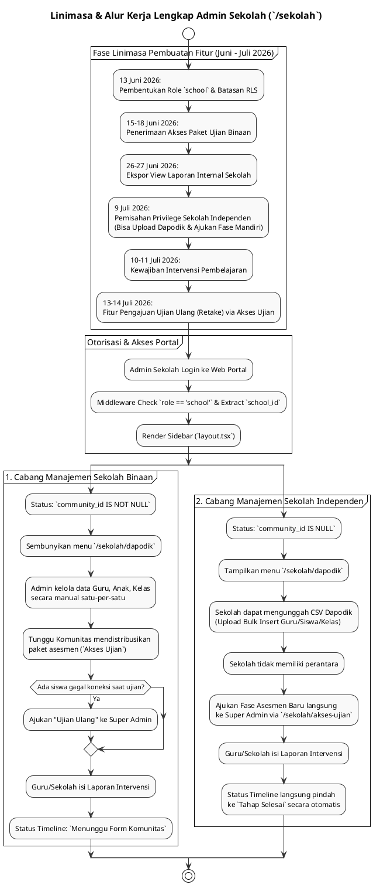

# DOKUMENTASI ANALISIS FITUR & LINIMASA ROLE SEKOLAH (`sekolah`)

**Sistem Asesmen Literasi & Numerasi Pemantik (PSPK)**  
*Dokumen ini disusun murni berdasarkan analisis implementasi kode aktual (`apps/web/src/app/sekolah`) dan riwayat penanggalan migrasi database tanpa asumsi AI, membedah kapabilitas role `school` serta kronologi pembangunannya.*

---

## 1. PENDAHULUAN & RENTANG WAKTU PENGEMBANGAN

Role **Sekolah** (`role = 'school'`) berfungsi sebagai Admin Tata Usaha atau Kepala Sekolah yang memiliki kendali penuh atas manajemen data di satu institusi pendidikan spesifik (`public.schools`). Role ini merupakan tulang punggung operasional platform Pemantik karena merekalah yang mengelola Kelas, Guru, Siswa, serta memicu dimulainya intervensi pembelajaran secara langsung di lapangan.

**Karakteristik Unik Cabang Kewenangan:**
Terdapat dua jenis entitas Sekolah di dalam sistem yang ditangani oleh kode layout yang sama:
1. **Sekolah Binaan**: Memiliki Induk/Komunitas (`community_id IS NOT NULL`). Akses ujian dan Dapodik dikendalikan oleh Komunitas.
2. **Sekolah Independen**: Berdiri sendiri tanpa Induk (`community_id IS NULL`). Mendapatkan hak istimewa (*privilege*) layaknya Komunitas untuk berinteraksi langsung dengan Super Admin.

### 📅 Rentang Waktu Pengembangan Aktual (Timeline Range):
**`13 Juni 2026` – `14 Juli 2026`**

> [!NOTE]
> **Klarifikasi Penanggalan Berkas Migrasi Awal**:  
> Sama halnya dengan modul sistem lain, seluruh pengembangan fitur Sekolah ini dikerjakan secara intensif pada **Juni – Juli 2026**. Penamaan file migrasi awal `20250613...` merupakan bug/typo penanggalan, sedangkan tanggal eksekusi nyatanya adalah **13 Juni 2026**.

---

## 2. LINIMASA (TIMELINE) LENGKAP EVOLUSI FITUR SEKOLAH (2026)

Berikut adalah linimasa kronologis spesifik untuk pengembangan fitur-fitur yang berpusat pada hak akses Admin Sekolah:

```
[13 JUN 2026] ──► FONDASI AWAL ADMIN SEKOLAH
                  • Pembuatan enum role `school` dan relasinya ke tabel `public.schools`.
                  • Pemasangan RLS Policies dasar yang menjamin Admin Sekolah hanya dapat mengakses `classes`, `users (teacher)`, dan `students` yang berafiliasi dengan ID sekolah mereka.

[15-18 JUN 2026] ─► DISTRIBUSI PAKET UJIAN
                  • Pembuatan tabel `assessment_access` (`phase2_access_management.sql`).
                  • Terciptanya menu **Akses Ujian** (`/sekolah/akses-ujian`). Pada titik ini, sekolah hanya bersifat pasif menerima paket yang dikirimkan oleh Komunitas.

[26-27 JUN 2026] ─► VIEW LAPORAN SEKOLAH
                  • Pembuatan View Laporan Lintas Entitas (`week4_report_view.sql`).
                  • Pembentukan menu **Hasil Ujian** (`/sekolah/laporan`) yang menyajikan ekspor skor agregat per kelas secara spesifik untuk sekolah tersebut.

[6-8 JUL 2026] ──► INTEGRASI DAPODIK INTERNAL
                  • Penciptaan fitur Import Dapodik Masal berbasis transaksi DB (`dapodik_import.sql`). Awalnya dirancang terpusat.

[9 JUL 2026] ────► KEBANGKITAN SEKOLAH INDEPENDEN
                  • Restrukturisasi skema yang mengizinkan `community_id IS NULL` (`community_rombak_schema.sql`).
                  • **Perombakan Menu Akses Ujian**: Sekolah Independen kini memiliki form untuk **mengajukan Fase langsung ke Super Admin** tanpa perantara Komunitas.
                  • **Perombakan Menu Dapodik**: Lahirnya menu eksklusif **Upload Data Dapodik** (`/sekolah/dapodik`) yang *hanya* muncul jika sekolah berstatus independen.

[10-11 JUL 2026] ─► FORM INTERVENSI SEKOLAH
                  • Pembuatan arsitektur pelaporan intervensi (`superadmin_ai_knowledge_graph.sql`).
                  • Terciptanya menu **Intervensi** (`/sekolah/intervensi`). Admin Sekolah / Guru kini diwajibkan mengisi refleksi pembelajaran agar tahap asesmen selesai.

[13-14 JUL 2026] ─► MANAJEMEN KENDALA TEKNIS (RETAKE REQUEST)
                  • Penciptaan tabel `assessment_retake_requests` (`20260713000000...`).
                  • **Pembaruan Akses Ujian**: Sekolah kini diberi tombol **"Ajukan Ujian Ulang"** untuk meminta reset sesi anak yang mengalami error gawai/jaringan kepada Super Admin.
```

---

## 3. ANALISIS RINCI 8 FITUR / MENU UTAMA SEKOLAH

Seluruh struktur fitur Sekolah terpusat pada direktori [`apps/web/src/app/sekolah`](file:///Users/imadearisdanuarta/Documents/KERJAAN/Develop%20pemantik/pemantik/apps/web/src/app/sekolah) yang diatur oleh logika rendering dinamis pada [`layout.tsx`](file:///Users/imadearisdanuarta/Documents/KERJAAN/Develop%20pemantik/pemantik/apps/web/src/app/sekolah/layout.tsx):

### A. KELOMPOK 1: DASHBOARD
1. **Dashboard (`/sekolah/dashboard`)**:
   * **Fungsi**: Pusat pendaratan informasi Admin Sekolah.
   * **Fitur Utama**: Menampilkan Linimasa (*Timeline*) 5 Tahap Asesmen, rekapitulasi jumlah Kelas, Guru, Siswa, dan riwayat penyelesaian sesi asesmen terbaru oleh anak didik.

---

### B. KELOMPOK 2: MANAJEMEN DATA
2. **Upload Data Dapodik (`/sekolah/dapodik`)**:
   * **Fungsi Khusus**: *Menu ini disembunyikan secara bawaan (Hidden by default).*
   * **Fitur Utama**: Hanya akan di-render di sidebar jika logika di `layout.tsx` mendeteksi status `isIndependent = true` (Sekolah tanpa Komunitas). Sekolah Independen dapat langsung mengunggah file CSV Dapodik untuk memasukkan data Kelas, Guru, dan Siswa secara instan.

3. **Guru (`/sekolah/guru`)**:
   * **Fungsi**: Manajemen staf pengajar.
   * **Fitur Utama**: Admin Sekolah dapat menambah (Create), mengedit nama/username (Update), dan menghapus (Delete) akun Guru. Password Guru yang baru dibuat secara default diatur ke `"Password123!"`.

4. **Anak / Siswa (`/sekolah/siswa`)**:
   * **Fungsi**: Manajemen peserta didik (pengguna aplikasi mobile).
   * **Fitur Utama**: Penambahan/Perubahan siswa, pengisian data pelengkap (NISN, Gender, Tanggal Lahir), dan alokasi/pemindahan siswa ke Kelas tertentu.

5. **Kelas (`/sekolah/kelas`)**:
   * **Fungsi**: Manajemen rombongan belajar.
   * **Fitur Utama**: Menambahkan Kelas, mengatur tingkat (Grade 1-6), dan **menugaskan Guru (Wali Kelas)**. Guru yang ditugaskan di sini adalah landasan dari batasan RLS pada role Guru (di mana Guru hanya bisa melihat data anak di kelas yang ditugaskan kepadanya).

6. **Akses Ujian (`/sekolah/akses-ujian`)**:
   * **Fungsi**: Portal perizinan evaluasi dan resolusi masalah teknis.
   * **Fitur Utama (Sekolah Binaan)**: Hanya bisa memantau paket aktif dan mengajukan **"Ujian Ulang" (*Retake Requests*)** ke pusat apabila ada kelas atau siswa yang gagal submit karena gawai/koneksi mati.
   * **Fitur Utama (Sekolah Independen)**: Selain *Retake Request*, memiliki modal khusus untuk **Mengajukan Fase Asesmen Baru** langsung ke Super Admin.

---

### C. KELOMPOK 3: UJIAN & INTERVENSI
7. **Hasil Ujian (`/sekolah/laporan`)**:
   * **Fungsi**: Pelaporan analitik (*Assessment Reports*).
   * **Fitur Utama**: Mengakses dan mengekspor nilai akhir, durasi pengerjaan, dan tingkat kelulusan tiap kelas dan siswa di internal sekolah mereka.

8. **Intervensi (`/sekolah/intervensi`)**:
   * **Fungsi**: Pelaporan konkrit pedagogis (Tahap 4).
   * **Fitur Utama**: 
     * Saat timeline asesmen tiba di fase "Intervensi", menu ini akan terbuka. Admin Sekolah (bersama Guru) mengisi form naratif 4 aspek (Kondisi Awal, Upaya, Perubahan, Alasan) plus *Tagging Topik*.
     * **Auto-Selesai (Independen)**: Bagi Sekolah Independen, pengiriman 1 laporan dari menu ini akan langsung merubah status Tahap Asesmen menjadi "Selesai" (Tahap 5).
     * **Tertahan (Binaan)**: Bagi Sekolah Binaan, laporan akan berstatus *Menunggu Form Komunitas* sampai Induk Komunitas mereka juga ikut men-*submit* intervensi.

---

## 4. KODE PLANTUML ALUR KERJA & LINIMASA SEKOLAH

Berikut adalah kode Diagram PlantUML yang memvisualisasikan kronologi fitur sekaligus alur kerja pencabangan logika (Binaan vs Independen) pada role Admin Sekolah:


