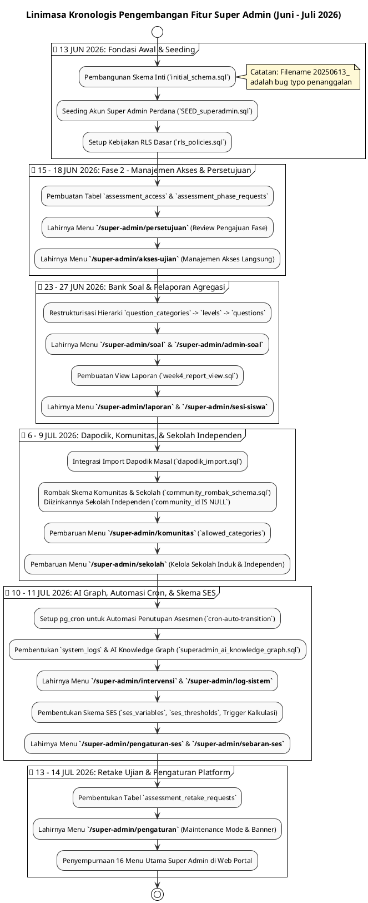

# DOKUMENTASI ANALISIS FITUR & LINIMASA PENGEMBANGAN SUPER ADMIN

**Sistem Asesmen Literasi & Numerasi Pemantik (PSPK)**  
*Dokumen ini disusun murni berdasarkan analisis implementasi kode aktual (`apps/web/src/app/super-admin`) dan riwayat penanggalan migrasi database (`supabase/migrations/*`) tanpa asumsi AI, membedah seluruh 16 fitur utama Super Admin serta rentang waktu pembuatannya secara otentik.*

---

## 1. PENDAHULUAN & RENTANG WAKTU PENGEMBANGAN

Role **Super Admin** (`role = 'super_admin'`) merupakan pusat kendali tertinggi (*Supreme Authority*) dalam platform Pemantik. Super Admin mengelola seluruh hierarki entitas mulai dari Komunitas, Sekolah (Induk maupun Independen), Guru, Anak/Siswa, Bank Soal, Persetujuan Fase Asesmen, Parameter SES (Status Sosial Ekonomi), hingga Log Sistem dan AI Knowledge Graph.

### 📅 Rentang Waktu Pengembangan Aktual (Timeline Range):
**`13 Juni 2026` – `14 Juli 2026` (Intensif ± 1 Bulan Penuh)**

> [!NOTE]
> **Klarifikasi Penanggalan Berkas Migrasi Awal**:  
> Seluruh pengembangan sistem dan fitur platform Pemantik dikerjakan secara intensif pada **Tahun 2026 (Juni – Juli 2026)**. Berkas migrasi awal yang memiliki prefiks tahun 2025 (`20250613000001_initial_schema.sql`, `20250613000002_rls_policies.sql`, dan `20250613000003_auth_hook.sql`) merupakan **bug penanggalan/typo penamaan berkas saat pembuatan awal** yang sebenarnya dibuat dan dieksekusi pada **13 Juni 2026**.

* **Titik Awal Fondasi (13 Juni 2026)**: Pembangunan fondasi skema database awal (`initial_schema.sql`), kebijakan RLS pertama, dan seeding akun Super Admin pertama.
* **Fase Akselerasi & Pemantapan Arsitektur (15 Juni – 14 Juli 2026)**: Pengembangan masif seluruh 16 modul interaktif Web Portal (`apps/web/src/app/super-admin`), restrukturisasi Sekolah Independen, pemisahan Komunitas, integrasi Dapodik, automasi cron/retake ujian, serta penambahan analitik SES dan AI Knowledge Graph dalam kurun waktu 1 bulan penuh.

---

## 2. LINIMASA (TIMELINE) LENGKAP PENGEMBANGAN FITUR SUPER ADMIN (JUNI - JULI 2026)

Berikut adalah linimasa kronologis pengembangan fitur-fitur Super Admin yang dipetakan secara akurat pada tahun pengerjaan **2026**:

```
[13 JUN 2026] ──► FONDASI AWAL & SEEDING SUPER ADMIN (Catatan: file bernama 20250613_ karena bug typo)
                  • Pembentukan skema inti public.users, communities, schools, dan classes.
                  • Seeding akun Super Admin perdana (`SEED_superadmin.sql`).
                  • Pembentukan kebijakan RLS dasar (`rls_policies.sql`).

[15-18 JUN 2026] ─► MANAJEMEN AKSES UJIAN & PERSETUJUAN FASE
                  • Penambahan field demografi guru & anak (`20260615123227_...`).
                  • Pembuatan tabel `assessment_access` dan `assessment_phase_requests` (`20260618140000_...`).
                  • Lahirnya menu:
                    - `/super-admin/persetujuan` (Persetujuan Fase)
                    - `/super-admin/akses-ujian` (Manajemen Akses Ujian Langsung)

[23-24 JUN 2026] ─► HIERARKI KATEGORI & BANK SOAL AUTO PILOT
                  • Restrukturisasi paket soal menjadi `question_categories`, `question_levels`, dan `questions`.
                  • Lahirnya menu:
                    - `/super-admin/soal` (Bank Soal Global)
                    - `/super-admin/admin-soal` (Manajemen Akun Pembuat Soal)

[26-27 JUN 2026] ─► FONDASI DATA, RLS SESI SISWA, & VIEW LAPORAN
                  • Penataan keamanan RLS berlapis untuk mobile & web (`week1_student_jwt_rls.sql`).
                  • Pembuatan view pelaporan agregasi `week4_report_view.sql`.
                  • Lahirnya menu:
                    - `/super-admin/laporan` (Rekap & Export Hasil Ujian)
                    - `/super-admin/sesi-siswa` (Monitoring Sesi Pengerjaan Anak)

[6-8 JUL 2026] ──► INTEGRASI IMPORT DAPODIK & EVALUASI LEVEL
                  • Dukungan import data Dapodik masal (Sekolah, Guru, Siswa sekaligus) via `20260707000001_dapodik_import.sql`.
                  • Perbaikan fungsi RPC `advance_student_level()` di PostgreSQL untuk sinkronisasi mobile.

[9 JUL 2026] ────► ROMBAK SKEMA KOMUNITAS & SEKOLAH INDEPENDEN
                  • Pemisahan tegas antara Sekolah Binaan Komunitas vs Sekolah Independen (`community_rombak_schema.sql`).
                  • Diizinkannya `community_id IS NULL` pada tabel `schools` dan `assessment_phase_requests`.
                  • Penambahan fitur `allowed_categories` di tabel `communities`.
                  • Pembaruan menu:
                    - `/super-admin/komunitas` (Pengaturan paket soal per komunitas)
                    - `/super-admin/sekolah` (Pengelolaan Sekolah Independen tanpa komunitas)

[10 JUL 2026] ───► AI KNOWLEDGE GRAPH, LOG SISTEM, & AUTOMASI CRON
                  • Pembentukan struktur `superadmin_ai_knowledge_graph.sql` dan `system_logs`.
                  • Setup pg_cron untuk `cron-auto-transition` (penutupan otomatis asesmen kedaluwarsa).
                  • Lahirnya menu:
                    - `/super-admin/intervensi` (Monitoring Intervensi & Graph AI)
                    - `/super-admin/log-sistem` (Log Sistem, Error, & Feedback)

[11 JUL 2026] ───► SKEMA SES (STATUS SOSIAL EKONOMI) & SEBARAN DEMOGRAFI
                  • Pembentukan tabel `ses_variables`, `ses_thresholds`, dan trigger otomatis kalkulasi `ses_class`.
                  • Lahirnya menu:
                    - `/super-admin/pengaturan-ses` (Konfigurasi Bobot & Threshold SES)
                    - `/super-admin/sebaran-ses` (Analitik Demografi & Distribusi SES Nasional)

[13-14 JUL 2026] ─► MANAJEMEN RETAKE UJIAN & PENGATURAN PLATFORM
                  • Pembentukan tabel `assessment_retake_requests` untuk pengajuan ulang ujian anak (`20260713000000_...`).
                  • Pemantapan RLS untuk Sekolah Independen (`20260714000001_fix_independent_schools.sql`).
                  • Lahirnya menu:
                    - `/super-admin/pengaturan` (Pengaturan Banner, Mode Perbaikan/Maintenance, & Sistem Platform)
```

---

## 3. ANALISIS RINCI 16 FITUR / MENU UTAMA SUPER ADMIN

Seluruh struktur fitur Super Admin diorganisasikan ke dalam 5 kelompok navigasi pada [`layout.tsx`](file:///Users/imadearisdanuarta/Documents/KERJAAN/Develop%20pemantik/pemantik/apps/web/src/app/super-admin/layout.tsx):

### A. KELOMPOK 1: DASHBOARD
1. **Dashboard (`/super-admin/dashboard`)**:
   * **Fungsi**: Pusat informasi eksekutif yang menampilkan statistik total secara real-time: Total Komunitas, Total Sekolah (Induk & Independen), Total Guru, Total Siswa, serta Total Sesi Asesmen Selesai.
   * **Fitur Utama**: Menampilkan grafik sebaran sekolah aktif, daftar pengajuan fase yang membutuhkan persetujuan segera (*Pending Requests*), serta notifikasi peringatan sistem.

---

### B. KELOMPOK 2: MANAJEMEN AKUN
2. **Manajemen Komunitas (`/super-admin/komunitas`)**:
   * **Fungsi**: Mengelola seluruh organisasi/dinas pembina sekolah (`public.communities`).
   * **Fitur Utama**:
     * Pembuatan akun Admin Komunitas baru (otomatis membuat di `auth.users` & `public.users`).
     * **Pembatasan Kategori (`allowed_categories`)**: Mengatur paket soal apa saja yang boleh diajukan atau diakses oleh komunitas tertentu (misal: Komunitas A hanya boleh mengakses paket Literasi SD).
     * Aktivasi/Deaktivasi status komunitas (`is_active`).

3. **Manajemen Sekolah (`/super-admin/sekolah`)**:
   * **Fungsi**: Mengelola seluruh sekolah di Indonesia yang terdaftar dalam platform (`public.schools`).
   * **Fitur Utama**:
     * **Dukungan Sekolah Induk vs Sekolah Independen**: Super Admin dapat membuat sekolah di bawah naungan komunitas tertentu (`community_id IS NOT NULL`) atau langsung sebagai **Sekolah Independen** (`community_id IS NULL`).
     * **Import Dapodik Masal**: Mengunggah spreadsheet/JSON Dapodik untuk membuat data sekolah, daftar kelas, akun guru, dan akun siswa dalam 1 kali proses transaksi (`importDapodikAction`).
     * Pemantauan progres tahap asesmen per sekolah (`school_assessment_stages`).

4. **Manajemen Admin Soal (`/super-admin/admin-soal`)**:
   * **Fungsi**: Mengelola akun-akun kreator atau editor konten soal (`question_admins`).
   * **Fitur Utama**: Memberikan hak akses pembuatan/penyuntingan butir soal pada kategori atau level tertentu tanpa memberikan hak administratif sistem lainnya.

---

### C. KELOMPOK 3: REKAP GLOBAL (READ & EXPORT ONLY)
5. **Semua Guru (`/super-admin/guru`)**:
   * **Fungsi**: Direktori global seluruh guru dari berbagai sekolah dan komunitas di platform.
   * **Fitur Utama**: Pencarian lintas sekolah berdasarkan NIP/Nama/Email, filter wilayah/komunitas, dan ekspor rekap data guru ke format CSV/Excel.

6. **Semua Anak (`/super-admin/siswa`)**:
   * **Fungsi**: Direktori global seluruh siswa/anak mobile (`public.students`).
   * **Fitur Utama**:
     * Pencarian cepat berdasarkan NISN, Nama, atau Username.
     * Pemantauan klasifikasi SES siswa (`bawah`, `menengah_bawah`, `menengah_atas`, `atas`).
     * **Reset PIN Masal/Individual**: Kemampuan mereset PIN anak yang bermasalah kembali ke default `123456`.
     * Ekspor data siswa berskala besar.

7. **Bank Soal Global (`/super-admin/soal`)**:
   * **Fungsi**: Melihat dan mengaudit seluruh struktur Bank Soal platform (`question_categories` ➔ `question_levels` ➔ `questions`).
   * **Fitur Utama**: Memantau butir soal yang aktif (`is_published = true`), batas waktu pengerjaan (`time_limit_sec`), passing threshold tiap level, dan pengecekan kelengkapan URL media (audio/video/gambar).

---

### D. KELOMPOK 4: MANAJEMEN UJIAN
8. **Persetujuan Fase (`/super-admin/persetujuan`)**:
   * **Fungsi**: Meja persetujuan (*Review & Approval Desk*) untuk pengajuan jadwal asesmen (`assessment_phase_requests`).
   * **Fitur Utama**:
     * Meninjau pengajuan yang masuk dari Admin Komunitas (untuk sekolah binaan) maupun dari Admin Sekolah Independen (tanpa komunitas).
     * **Approve**: Mengubah status menjadi `'approved'`, otomatis membuat baris di `assessment_access`, mendistribusikan akses ke sekolah target, dan menaikkan tahap sekolah ke `'proses_asesmen'`.
     * **Reject**: Menolak pengajuan dengan mencantumkan alasan penolakan (`rejection_reason`) agar diperbaiki oleh pengaju.

9. **Sesi Ujian Anak (`/super-admin/sesi-siswa`)**:
   * **Fungsi**: Pusat kendali dan pemantauan live seluruh sesi pengerjaan asesmen siswa (`assessment_sessions`).
   * **Fitur Utama**:
     * Memantau status sesi (`in_progress`, `completed`, `void`, `expired`).
     * Melihat skor pengerjaan aktual, durasi (`time_spent_sec`), dan detail jawaban per butir soal (`student_answers`).
     * **Manajemen Retake (`assessment_retake_requests`)**: Menyetujui pengajuan mengulang ujian dari guru/sekolah apabila terjadi kendala teknis saat anak mengerjakan soal.

10. **Akses Ujian (`/super-admin/akses-ujian`)**:
    * **Fungsi**: Pengelolaan manual/darurat untuk pemberian atau pencabutan akses ujian (`assessment_access`).
    * **Fitur Utama**: Memperpanjang tanggal berakhirnya asesmen (`valid_until`), menonaktifkan akses secara instan (`is_active = false`), atau menambahkan sekolah secara ad-hoc ke dalam paket ujian.

---

### E. KELOMPOK 5: LAPORAN & SISTEM
11. **Intervensi & Graph (`/super-admin/intervensi`)**:
    * **Fungsi**: Pemantauan nasional terhadap laporan pembinaan intervensi (`interventions`) yang diisi oleh Guru dan Komunitas.
    * **Fitur Utama**: Menampilkan grafik korelasi tag topik intervensi (`intervention_tags`) dengan peningkatan skor anak, serta memanfaatkan struktur AI Knowledge Graph (`superadmin_ai_knowledge_graph.sql`) untuk pemetaan masalah pembelajaran.

12. **Hasil Ujian / Laporan (`/super-admin/laporan`)**:
    * **Fungsi**: Modul pelaporan analitik komprehensif berdasarkan view database (`week4_report_view`).
    * **Fitur Utama**:
      * Agregasi capaian kelulusan per provinsi, kabupaten/kota, komunitas, sekolah, dan kelas.
      * Analisis kelemahan butir soal (*Item Analysis*).
      * Ekspor laporan resmi untuk keperluan dinas atau evaluasi nasional.

13. **Sebaran SES (`/super-admin/sebaran-ses`)**:
    * **Fungsi**: Analitik demografi khusus Status Sosial Ekonomi (SES) siswa di seluruh Indonesia.
    * **Fitur Utama**: Menampilkan peta dan grafik distribusi persentase siswa pada kelas SES `I` hingga `IV` per wilayah, membantu pengambilan keputusan intervensi kebijakan pendidikan yang tepat sasaran.

14. **Log Sistem & Error (`/super-admin/log-sistem`)**:
    * **Fungsi**: Blackbox dan pusat diagnostik teknis platform (`public.system_logs` dan `feedback_logs`).
    * **Fitur Utama**:
      * Memantau error eksekusi Edge Functions, kegagalan sinkronisasi mobile (`sync_error`), atau anomali query database.
      * Meninjau umpan balik balik/keluhan pengguna dari dalam aplikasi.

15. **Pengaturan SES (`/super-admin/pengaturan-ses`)**:
    * **Fungsi**: Mesin kalibrasi rumus dan klasifikasi Status Sosial Ekonomi (`SesManager.tsx`).
    * **Fitur Utama**:
      * Mengatur bobot poin untuk setiap tingkat pendidikan ayah/ibu (`father/mother_education_id`) dan pekerjaan ayah/ibu (`father/mother_occupation_id`) pada tabel `ses_variables`.
      * Mengatur batas ambang skor (*scoring thresholds*) pada tabel `ses_thresholds` untuk menentukan kapan seorang anak diklasifikasikan ke `bawah`, `menengah_bawah`, `menengah_atas`, atau `atas`.

16. **Pengaturan Platform (`/super-admin/pengaturan`)**:
    * **Fungsi**: Pengaturan global dan pemeliharaan platform (`system_settings`).
    * **Fitur Utama**:
      * **Mode Pemeliharaan (Maintenance Mode)**: Mengaktifkan/menonaktifkan pesan maintenance global (`ADD_MAINTENANCE_MESSAGE.sql`) yang akan memblokir login sementara saat pembaruan sistem.
      * **Banner Pengumuman**: Menayangkan spanduk informasi/alert di bagian atas dashboard seluruh pengguna (Komunitas, Sekolah, Guru).

---

## 4. KODE PLANTUML LINIMASA & ARSITEKTUR FITUR SUPER ADMIN (JUNI - JULI 2026)

Berikut adalah kode PlantUML yang menggambarkan Linimasa Pengembangan dan Peta Arsitektur Kendali Super Admin pada tahun pengerjaan **2026**:


