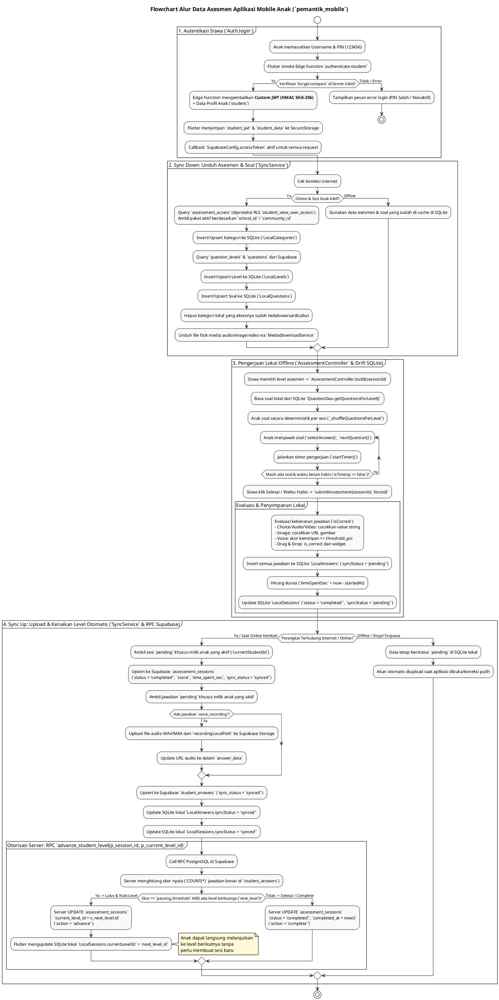

# DOKUMENTASI TEKNIS LENGKAP APLIKASI MOBILE ANAK (`pemantik_mobile`)

**Sistem Asesmen Literasi & Numerasi Pemantik (PSPK)**  
*Dokumen ini disusun murni berdasarkan implementasi kode aktual tanpa asumsi AI, mencakup seluruh alur data dari autentikasi, unduh asesmen, pengerjaan lokal offline, penyimpanan SQLite, hingga sinkronisasi dua arah dengan Supabase.*

---

## 1. PENDAHULUAN & ARSITEKTUR UMUM

Aplikasi mobile anak (`pemantik_mobile`) dirancang dengan arsitektur **Offline-First**. Anak dapat mengerjakan asesmen baik saat perangkat terhubung internet maupun di daerah minim sinyal (offline total).

### Stack Teknologi Utama:
* **Framework**: Flutter & Dart (`SDK >=3.2.0 <4.0.0`)
* **State Management**: Riverpod (`riverpod_annotation`, `flutter_riverpod`)
* **Database Lokal (Offline Engine)**: Drift ORM berbasis SQLite (`pemantik_offline.sqlite`, skema versi 12)
* **Secure Storage**: `flutter_secure_storage` (untuk token JWT dan data profil anak)
* **Backend Integration**: `supabase_flutter` terintegrasi dengan RLS (Row Level Security) dan Edge Functions

---

## 2. CARA GET DATA ANAK (AUTENTIKASI & PROFIL SISWA)

Berbeda dengan akun dewasa (Super Admin, Komunitas, Sekolah, Guru) yang tercatat di `auth.users` dan `public.users`, akun anak disimpan **eksklusif** di tabel `public.students`.

### A. Alur Login (`Auth.login` di `auth_provider.dart`)
1. **Input User**: Anak memasukkan `username` dan `PIN` (PIN default `123456`) di halaman login.
2. **Eksekusi Edge Function**: Aplikasi memanggil Edge Function `authenticate-student` via HTTP Post dengan timeout 20 detik:
   ```dart
   final response = await SupabaseConfig.client.functions.invoke(
     'authenticate-student',
     body: {'username': username, 'pin': pin},
   ).timeout(const Duration(seconds: 20));
   ```
3. **Verifikasi Server (`supabase/functions/authenticate-student/index.ts`)**:
   * Server mencocokkan `username` dan memverifikasi `pin_hash` menggunakan `bcrypt.compare`.
   * Jika valid, server meng-generate **Custom JWT (HMAC SHA-256)** yang ditandatangani dengan `STUDENT_JWT_SECRET`.
   * Payload JWT berisikan klaim isolasi RLS:
     * `sub`: ID Siswa (`student.id`)
     * `role`: `"anon"` (agar lolos pengecekan standar Supabase)
     * `user_role`: `"student"`
     * `student_id`: ID Siswa
     * `school_id`: ID Sekolah
     * `class_id`: ID Kelas
     * `community_id`: ID Komunitas (dari relasi sekolah)
4. **Penyimpanan di Secure Storage (`auth_provider.dart`)**:
   ```dart
   await _storage.write(key: SupabaseConfig.studentJwtKey, value: token.toString());
   await _storage.write(key: 'student_data', value: jsonEncode(student));
   ```
5. **Injeksi Otomatis ke Setiap Request (`SupabaseConfig` di `supabase_client.dart`)**:
   Supabase dikonfigurasi dengan callback `accessToken` yang selalu membaca `student_jwt`:
   ```dart
   accessToken: () async {
     return await secureStorage.read(key: SupabaseConfig.studentJwtKey);
   }
   ```
   *Dengan ini, setiap query dari aplikasi mobile otomatis terautentikasi dan diproteksi oleh RLS (`jwt_student_id()`, `jwt_user_role_extended()`).*

### B. Pengecekan Sesi Awal & Logout
* **Check Initial Auth (`checkInitialAuth()`)**: Saat `SplashScreen` dibuka, aplikasi mengecek keberadaan `student_jwt` dan `student_data` di Secure Storage. Jika keduanya ada, anak langsung diarahkan ke Dashboard dan memicu `uploadCompletedSessions()` di background.
* **Logout (`Auth.logout()`)**: Menghapus seluruh data dari Secure Storage (`_storage.deleteAll()`) dan membersihkan seluruh isi database SQLite lokal (`db.clearAllData()`) guna mencegah kebocoran data antar siswa jika bergantian perangkat.

---

## 3. CARA GET ASESMEN & CACHING SOAL (SYNC DOWN)

Aplikasi mendapatkan paket asesmen, level, dan soal melalui mekanisme **Sync Down** yang dijalankan oleh `SyncService.syncCategoriesAndQuestions()` di `sync_service.dart`.

### A. Pengambilan Akses (`assessment_access`)
Aplikasi melakukan query ke tabel `assessment_access` untuk mengambil paket soal yang sedang aktif bagi sekolah anak tersebut:
```dart
final accessResponse = await SupabaseConfig.client
    .from('assessment_access')
    .select('id, category_id, phase, valid_from, valid_until, question_categories ( id, name, subject_area )')
    .eq('is_active', true);
```
*RLS di Supabase (`student_view_own_access`) secara otomatis memvalidasi bahwa akses tersebut ditujukan untuk `school_id` atau `community_id` siswa dalam rentang `valid_from` hingga `valid_until`.*

### B. Penyimpanan Struktur ke Database SQLite (`AppDatabase`)
Untuk setiap paket yang diizinkan, aplikasi menyimpan datanya ke tabel-tabel lokal SQLite menggunakan **Drift DAO**:
1. **Kategori / Paket (`LocalCategories`) via `CategoryDao.upsertCategory()`**:
   Menyimpan `id`, `name`, `subjectArea`, `phase`, `validFrom`, `validUntil`, dan `accessId`.
2. **Level (`LocalLevels`) via `LevelDao.upsertLevel()`**:
   Mengambil dari tabel `question_levels` di Supabase dan menyimpannya ke lokal berisikan `id`, `categoryId`, `levelNumber`, `timeLimitSec`, `passingThreshold`, `accessCode`, serta pesan capaian (`learningObjective`, `successMessage`, `failureMessage`).
3. **Soal (`LocalQuestions`) via `QuestionDao.upsertQuestion()`**:
   Mengambil soal yang dipublish (`is_published = true`) beserta batas waktu dari level:
   ```dart
   final questionsResponse = await SupabaseConfig.client
       .from('questions')
       .select('*, question_levels!inner(category_id, time_limit_sec)')
       .eq('question_levels.category_id', pkgData['id'])
       .eq('is_published', true);
   ```
   Data soal (`question_text`, `question_type`, URL media, `optionsJson`, `correctAnswerJson`, `version`, `timeLimitSec`) disimpan ke tabel `local_questions`.
4. **Pembersihan Akses Kedaluwarsa**:
   Jika ada kategori lokal yang ID-nya sudah tidak ada lagi dalam daftar `activeCategoryIds` dari Supabase, aplikasi otomatis menghapusnya dari SQLite (`_db.categoryDao.deleteCategory(localCat.id)`).

### C. Unduh Media Offline (`MediaDownloadService`)
Jika soal memiliki file media (`question_audio_url`, `question_video_url`, `question_image_url`), `MediaDownloadService` bertugas mengunduh file fisik tersebut dari Supabase Storage ke direktori lokal perangkat (`getApplicationDocumentsDirectory()`) agar audio/video/gambar tetap bisa diputar meski offline.

---

## 4. PENGERJAAN ASESMEN & PENYIMPANAN LOKAL (SQLITE VIA DRIFT)

Saat anak menekan tombol mulai pada suatu level, seluruh interaksi pengerjaan dikelola secara lokal oleh `AssessmentController` di `assessment_provider.dart`.

### A. Inisialisasi & Pengacakan Soal (`AssessmentController.build`)
1. Aplikasi membaca data sesi dari `local_sessions` di SQLite berdasarkan `sessionId`.
2. Mengambil daftar soal lokal via `db.questionDao.getQuestionsForLevel(session.levelId!)`.
3. Soal diacak secara deterministik (`_shuffleQuestionsPerLevel`) berdasarkan `sessionId.hashCode` dan dikelompokkan per `levelId`.
4. Data soal diparse ke dalam objek dart `QuestionData` dan dimasukkan ke `AssessmentState` dengan `PageController`.

### B. Interaksi & Timer Pengerjaan
* **Pilihan Jawaban (`selectAnswer()`)**: Memasukkan jawaban siswa ke `Map<String, String> answers` di dalam state.
* **Navigasi (`nextQuestion()`, `jumpToQuestion()`)**: Menggerakkan `PageController` dan mengupdate indeks soal saat ini ke SQLite via `db.sessionDao.updateQuestionIndex(sessionId, nextIndex)`.
* **Timer (`startTimer()`)**: Menjalankan hitung mundur detik (`remainingSeconds`) sesuai `timeLimitSec`. Jika waktu habis (`remainingSeconds <= 0`), sistem otomatis memanggil `forceSubmit()` (`forced: true`).

### C. Evaluasi & Penyimpanan Jawaban ke SQLite (`AssessmentController.submitAssessment`)
Saat siswa menyelesaikan asesmen (atau waktu habis), sistem melakukan evaluasi dan penyimpanan 100% lokal tanpa memerlukan koneksi internet:

1. **Evaluasi Kebenaran (`isCorrect`) per Tipe Soal**:
   * `multiple_choice`, `audio_question`, `video_question`: Membandingkan nilai pilihan user dengan `q.correctAnswer['answers']` atau `q.correctAnswer['value']`.
   * `image_choice`: Membandingkan URL/indeks gambar yang dipilih dengan `q.correctAnswer['url']`.
   * `voice_recording`: Menilai berdasarkan skor kemiripan suara dari widget merekam. Jika `(score * 100) >= threshold_pct` (default 80%), maka `isCorrect = true`.
   * `drag_drop`: Mengambil status evaluasi dari widget (`userAnswer` JSON mengandung `is_correct == true`).

2. **Penyimpanan Setiap Jawaban ke `LocalAnswers` (`AnswerDao`)**:
   Untuk setiap soal, aplikasi meng-insert baris ke tabel `local_answers`:
   ```dart
   await db.answerDao.into(db.localAnswers).insert(
     LocalAnswersCompanion(
       id: drift.Value(UuidHelper.generateV4()),
       sessionId: drift.Value(sessionId),
       questionId: drift.Value(q.id),
       answerData: drift.Value(isVoiceAnswer ? jsonEncode(parsed) : jsonEncode({'value': userAnswer})),
       recordingLocalPath: drift.Value(isVoiceAnswer ? parsed['path'] : null),
       questionVersion: drift.Value(q.version.toString()),
       isCorrect: drift.Value(isCorrect),
       score: drift.Value(isCorrect ? 1.0 : 0.0),
       syncStatus: const drift.Value('pending'),
       answeredAt: drift.Value(DateTime.now()),
     ),
   );
   ```

3. **Penyelesaian Sesi di `LocalSessions` (`SessionDao`)**:
   Menghitung durasi pengerjaan nyata (`timeSpentSec`) dari selisih `DateTime.now()` dengan `startedAt`, lalu mengupdate status sesi menjadi `'completed'`:
   ```dart
   await (db.update(db.localSessions)..where((t) => t.id.equals(sessionId))).write(
     LocalSessionsCompanion(
       status: const drift.Value('completed'),
       completedAt: drift.Value(DateTime.now()),
       syncStatus: const drift.Value('pending'),
       timeSpentSec: drift.Value(timeSpent),
     ),
   );
   ```

4. **Penentuan Status Lulus Sementara**:
   Mengevaluasi apakah total jawaban benar (`correctCount`) memenuhi `level.passingThreshold`. Pemicu upload ke Supabase (`uploadCompletedSessions()`) langsung dijalankan di background.

---

## 5. MENYIMPAN & MENAMPILKAN RIWAYAT (ASSESSMENT HISTORY)

Aplikasi menampilkan riwayat pengerjaan asesmen anak melalui penggabungan data offline (SQLite) dan data online (Supabase).

### A. Sinkronisasi Tarik Data Lama (`SyncService.syncPastSessions`)
Saat aplikasi terhubung internet, `syncPastSessions()` menarik riwayat sesi lama anak dari Supabase agar tersedia offline:
```dart
final sessionsResponse = await SupabaseConfig.client
    .from('assessment_sessions')
    .select('*, student_answers(*)')
    .eq('student_id', studentId);
```
Setiap sesi beserta rincian jawabannya di-insert/upsert ke tabel `local_sessions` dan `local_answers` dengan `syncStatus = 'synced'`.

### B. Penyediaan Data untuk UI (`assessment_history_provider.dart`)
Provider riwayat mengambil seluruh sesi dari SQLite (`db.sessionDao.getCompletedSessionsForStudent()`). Karena tabel `local_sessions` menampung baik sesi yang baru dikerjakan offline (`syncStatus = 'pending'`) maupun yang sudah terupload (`syncStatus = 'synced'`), anak dan guru dapat melihat riwayat asesmen secara komplet kapan pun tanpa ketergantungan jaringan.

---

## 6. PROSES SINKRON KE SUPABASE (`SYNC UP` & RPC `ADVANCE_STUDENT_LEVEL`)

Proses sinkronisasi ke atas (Sync Up) dijalankan oleh `SyncService.uploadCompletedSessions()` di `sync_service.dart`. Fungsi ini dipanggil otomatis setiap kali aplikasi dibuka (`checkInitialAuth()`) atau setelah siswa selesai mengerjakan soal (`submitAssessment()`).

### A. Validasi Sesi Aktif
Aplikasi membaca `student_data` dari Secure Storage dan memastikan bahwa upload **HANYA** dilakukan untuk sesi milik ID anak yang sedang aktif login (`currentStudentId`), guna mencegah bentrokan data jika satu tablet digunakan oleh beberapa anak secara bergantian.

### B. Upload Sesi Asesmen (`assessment_sessions`)
Mengambil semua sesi berstatus `syncStatus = 'pending'` dari SQLite, lalu melakukan upsert ke tabel `assessment_sessions` di Supabase:
```dart
await SupabaseConfig.client.from('assessment_sessions').upsert({
  'id': session.id,
  'student_id': session.studentId,
  'category_id': session.categoryId,
  'school_id': session.schoolId,
  'status': session.status,          // 'completed' atau 'in_progress'
  'score': correctCount,             // Jumlah jawaban benar
  'time_spent_sec': timeSpentSec,
  'phase': session.phase,
  'started_at': session.startedAt?.toIso8601String(),
  'completed_at': session.completedAt?.toIso8601String(),
  'sync_status': 'synced',
  'synced_at': DateTime.now().toIso8601String(),
  'attempt_number': session.attemptNumber,
  if (session.accessId != null) 'access_id': session.accessId,
  if (session.currentLevelId != null || session.levelId != null) 
    'current_level_id': session.currentLevelId ?? session.levelId,
  if (session.levelId != null || session.currentLevelId != null) 
    'level_id': session.levelId ?? session.currentLevelId,
});
await _db.sessionDao.updateSyncStatus(session.id, 'synced');
```

### C. Upload Jawaban Siswa (`student_answers`)
Untuk setiap jawaban pending dari anak tersebut (`getPendingAnswersForStudent(currentStudentId)`), aplikasi memanggil `_uploadSingleAnswer(answer)`:
* Jika jawaban berupa rekaman suara (`voice_recording`), aplikasi mengunggah file audio dari `recordingLocalPath` ke bucket Supabase Storage terlebih dahulu sebelum menyimpan URL-nya ke `answer_data`.
* Melakukan upsert ke tabel `student_answers` di Supabase dan mengubah status lokal menjadi `'synced'`:
  ```dart
  await SupabaseConfig.client.from('student_answers').upsert({
    'id': answer.id,
    'session_id': answer.sessionId,
    'question_id': answer.questionId,
    'answer_data': jsonDecode(answer.answerData),
    'is_correct': answer.isCorrect,
    'score': answer.score ?? (answer.isCorrect == true ? 1 : 0),
    'time_spent_sec': answer.timeSpentSec,
    'status': 'answered',
    'sync_status': 'synced',
    'answered_at': answer.answeredAt.toIso8601String(),
  }, onConflict: 'session_id,question_id');
  ```
* *Penanganan Error*: Jika terjadi error 403 atau sesi kedaluwarsa, status lokal ditandai sebagai `failed` (`session_expired`). Jika terjadi error jaringan biasa, status tetap `pending` untuk diulang pada siklus sync berikutnya.

### D. Pemanggilan RPC `advance_student_level` (Kenaikan Level Otomatis)
Setelah sesi berstatus `'completed'` dan seluruh jawabannya berhasil diunggah, `SyncService` memanggil **RPC PostgreSQL `advance_student_level`** di Supabase untuk mengevaluasi kenaikan level secara otoritatif di server:

```dart
final result = await SupabaseConfig.client.rpc(
  'advance_student_level',
  params: {
    'p_session_id': session.id,
    'p_current_level_id': levelId,
  },
);
```

#### Logika Internal `advance_student_level()` di PostgreSQL (`20260706000001_fix_advance_level_and_add_level_id.sql`):
1. **Validasi Sesi**: Memastikan sesi ada dan tidak berstatus `'void'` atau `'expired'`.
2. **Kalkulasi Skor Nyata di Server**: Menghitung jumlah jawaban benar langsung dari tabel `student_answers` yang baru saja diunggah:
   ```sql
   SELECT COUNT(*), COALESCE(SUM(CASE WHEN sa.is_correct = true THEN 1 ELSE 0 END), 0)
   INTO v_total_answers, v_level_score
   FROM student_answers sa
   JOIN questions q ON q.id = sa.question_id
   WHERE sa.session_id = p_session_id AND q.level_id = p_current_level_id;
   ```
3. **Pengecekan Level Berikutnya (`next_level`)**:
   Mencari level dengan `category_id` yang sama dan `level_number = v_current_level.level_number + 1`.
4. **Keputusan Kenaikan Level (Action: Advance vs Complete)**:
   * **`CASE A` (`advance`)**: Jika `v_level_score >= passing_threshold` **DAN** masih ada `next_level`:
     * Sistem melakukan `UPDATE assessment_sessions SET current_level_id = v_next_level.id, level_id = COALESCE(level_id, p_current_level_id)`.
     * Mengembalikan JSON `{ action: 'advance', next_level_id: ..., next_level_number: ... }`.
     * Di Flutter, aplikasi menangkap respons ini dan langsung mengupdate `LocalSessions.currentLevelId` ke ID level berikutnya sehingga anak bisa langsung melanjutkan asesmen ke level selanjutnya tanpa harus membuat sesi baru.
   * **`CASE B` (`complete`)**: Jika `v_level_score < passing_threshold` **ATAU** anak berada di level terakhir:
     * Sistem melakukan `UPDATE assessment_sessions SET status = 'completed', completed_at = now()`.
     * Mengembalikan JSON `{ action: 'complete', reason: 'below_threshold' | 'last_level_completed' }`.

---

## 7. SEMUA FUNGSI & KOMPONEN PENDUKUNG LAINNYA

1. **Manajemen Database & Migrasi Skema (`AppDatabase` di `database.dart`)**:
   * Skema database lokal telah berevolusi dari versi 1 hingga versi 12.
   * Versi 10 & 11 menambahkan dukungan `accessId` dan `currentLevelId` pada tabel `local_sessions` dan `local_categories` untuk mendukung tracking asesmen per sekolah/komunitas (Tahap 2).
   * Versi 12 menambahkan kolom pesan capaian (`learningObjective`, `successMessage`, `failureMessage`) pada tabel `local_levels`.
2. **Penanganan Audio Recording (`voice_recording`)**:
   Soal tipe rekaman suara direkam langsung oleh perangkat lokal, dinilai kemiripan fonetiknya secara otomatis oleh widget lokal, lalu file WAV/M4A disimpan sementara pada path lokal sebelum di-stream upload oleh `SyncService`.
3. **Isolasi Keamanan RLS (`20260626000001_week1_student_jwt_rls.sql`)**:
   * Fungsi helper SQL `jwt_student_id()` dan `jwt_user_role_extended()` membaca claims langsung dari header JWT (`request.jwt.claims`).
   * Seluruh policy seperti `student_view_own_access` menjamin bahwa siswa **mustahil** bisa membaca atau mengubah data sesi maupun jawaban milik siswa lain, sekalipun mereka mengetahui ID atau Token anon.

---

## 8. KODE PLANTUML ALUR DATA ASESMEN ANAK

Berikut adalah kode PlantUML Sequence & Activity Diagram yang menggambarkan seluruh siklus data asesmen anak secara presisi sesuai implementasi kode aktual:



---

## 9. RINGKASAN INTEGRASI FILE KODE UTAMA (`pemantik_mobile`)

| Komponen | Path File di `pemantik_mobile` / Supabase | Deskripsi Tugas |
| :--- | :--- | :--- |
| **Auth Provider** | `lib/features/auth/providers/auth_provider.dart` | Mengelola login siswa (`authenticate-student`), penyimpanan token ke `SecureStorage`, pengecekan sesi awal, & logout. |
| **Edge Auth Function** | `supabase/functions/authenticate-student/index.ts` | Memverifikasi `username` + `PIN` (bcrypt) dan menerbitkan Custom JWT (HMAC SHA-256) berisikan klaim RLS siswa. |
| **Supabase Client Config** | `lib/core/supabase/supabase_client.dart` | Menginjeksi `student_jwt` dari SecureStorage secara dinamis via callback `accessToken` pada setiap HTTP request. |
| **Drift AppDatabase** | `lib/core/database/database.dart` | Engine SQLite lokal (*Offline-First*) dengan skema migrasi versi 12 (`local_categories`, `local_levels`, `local_questions`, `local_sessions`, `local_answers`). |
| **Sync Service** | `lib/core/sync/sync_service.dart` | Mengelola *Sync Down* (unduh soal/level/kategori ke SQLite) dan *Sync Up* (upload sesi & jawaban pending ke Supabase, plus invoke RPC `advance_student_level`). |
| **Assessment Controller** | `lib/features/assessment/providers/assessment_provider.dart` | Mengatur pengerjaan soal lokal, pengacakan deterministik, navigasi timer, evaluasi jawaban otomatis (`selectAnswer`, `submitAssessment`), dan penyimpanan ke DAO. |
| **History Provider** | `lib/features/assessment/providers/assessment_history_provider.dart` | Menampilkan riwayat sesi pengerjaan anak dari kombinasi data SQLite offline dan sinkronisasi Supabase. |
| **RPC Advance Level** | `supabase/migrations/20260706000001_fix_advance_level_and_add_level_id.sql` | Fungsi otoritatif PostgreSQL untuk menghitung skor server dan menaikkan `current_level_id` atau menyelesaikan sesi. |
